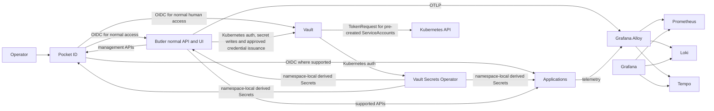
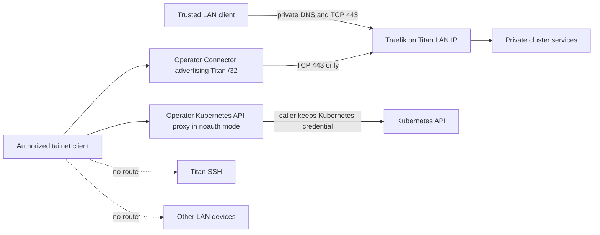
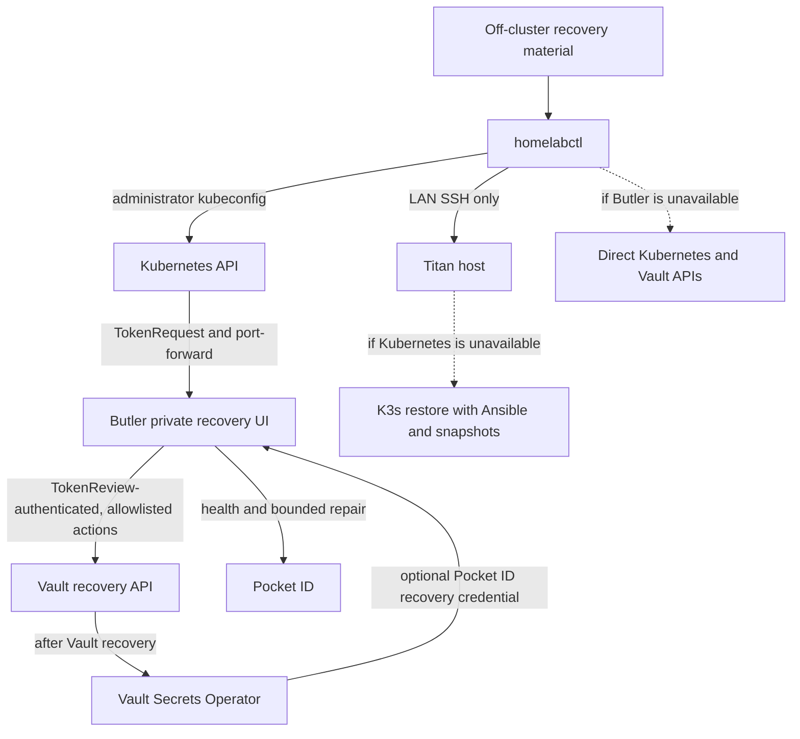
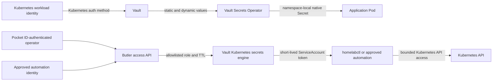
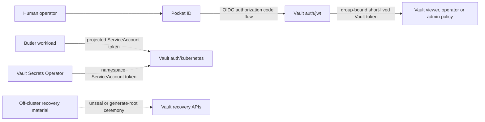
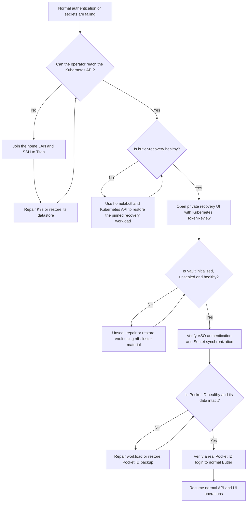

# Homelab platform plan

> **Implementation checkpoint — 28 August 2026:** the selected increments are
> now represented in the repository: per-application namespaces; Butler-owned
> Vault bootstrap with Kubernetes-auth runtime handoff, generated secrets and
> least-privilege credential projections; Pocket ID group/OIDC and Garage v2
> API reconciliation; and Prometheus, kube-state-metrics, node-exporter, Loki,
> Tempo, Alloy, Grafana and a separately managed Metrics Server. Butler also
> persists audit-safe operations, completes the Pocket ID handoff before
> becoming operational and issues allowlisted short-lived Kubernetes
> credentials. `homelabctl` now has interactive Pocket ID PKCE login. This
> document still describes later hardening and
> product work as future intent. Titan deployment evidence belongs in the
> current-state page, not in this plan.

Status: accepted architecture with an implementation backlog. This document describes
the intended end state; it does not claim that the current repository or Titan
already implements it.

## 1. Outcome

Build a recoverable single-node K3s homelab on the private mini PC named
`titan`, with an optional path to add tainted Hetzner workers later.

The platform will provide:

- declarative Kubernetes installation and upgrades through Helmfile;
- an API-driven control plane named Butler;
- an embedded Butler web interface built with Tailwind CSS for normal
  administration and guided recovery;
- a single operator interface through `homelabctl`;
- Pocket ID as the human identity provider;
- Vault as the source of truth for runtime secrets;
- Vault Secrets Operator (VSO) as the only normal delivery path from Vault to
  Kubernetes Secrets;
- Traefik ingress with publicly trusted certificates for private services;
- private LAN and Tailscale access without exposing the Kubernetes API, SSH, or
  internal applications to the public internet;
- bounded metrics, logs and traces for every service through Prometheus,
  Grafana, Loki, Tempo and Grafana Alloy;
- Home Assistant with a deliberate Zigbee architecture;
- off-node recovery material and tested restore procedures.

The first deployment is intentionally not highly available. Reliability comes
from small failure domains, backups, observability, and rehearsed recovery.

### 1.1 Accepted decisions

- Use one restricted namespace per user-facing application.
- Disable bundled K3s Traefik and manage ingress with Helmfile.
- Manage Metrics Server with Helmfile; it complements rather than replaces
  Prometheus.
- Use Pocket ID for normal human auth and Kubernetes TokenReview for the
  private bootstrap/recovery plane.
- Keep secrets in Vault and project workload-specific Kubernetes Secrets with
  Vault Secrets Operator.
- Start with manual Vault unseal and export the recovery Secret into an
  age-encrypted off-node bundle.
- Use only the in-cluster Tailscale operator when remote access is introduced.
- Keep PostgreSQL, Redis and Garage shared, with separate consumer credentials.
- Keep dashboards and alerts in Git.
- Keep the `ApplicationIntegration` ConfigMap API initially; defer a CRD.

The remaining storage decision is the encrypted off-node backup target. The
stateful platform is not recoverable until that target and a restore rehearsal
are documented.

## 2. Non-negotiable principles

### 2.1 Clear ownership

| Layer | Responsibility |
| --- | --- |
| Ansible | Debian, host users, SSH, packages, host firewall, time, K3s installation and upgrades |
| Terraform | Optional external infrastructure such as Hetzner nodes and networks |
| Helmfile | Kubernetes namespaces, policies, RBAC, charts, workloads, Services, Ingress, storage declarations and release ordering |
| Butler | API-driven configuration of running systems, users, groups, access, OAuth clients, Vault-backed integrations, status and reconciliation |
| `homelabctl` | Operator-facing workflows across Ansible, Terraform, Helmfile, Kubernetes and Butler |
| Vault | Source of truth for runtime secret values |
| Git | Non-secret desired state, policy and documentation |

Butler must not become a second Helmfile and must not install charts. Helmfile
installs software; Butler configures software after its management API is
healthy.

### 2.2 API-first management

Butler must use typed Go clients or HTTP APIs. It must not execute `kubectl`,
`helm`, `helmfile`, `vault`, `tailscale`, or arbitrary shell commands.

Examples:

- Kubernetes through `client-go` or `controller-runtime`;
- Vault through the official Go API;
- Pocket ID through its HTTP management API;
- Prometheus, Grafana and Tailscale through their supported APIs;
- application-specific APIs through bounded provider adapters.

`homelabctl` remains the recovery tool when Butler or the cluster is not
available. It may invoke external lifecycle tools where their CLI is the
supported interface, including Ansible, Terraform and Helmfile. Over time,
stable Go APIs should replace subprocesses where doing so does not reimplement
the external tool.

### 2.3 Secrets originate in Vault

Every application and platform runtime secret originates in Vault and is
delivered to Kubernetes through VSO:

```text
Vault -> Vault Secrets Operator -> namespace-local Kubernetes Secret -> workload
```

This includes:

- Pocket ID runtime and management credentials;
- OAuth client IDs and client secrets;
- DNS-provider credentials used by cert-manager;
- Grafana and application credentials;
- database, Redis and MQTT credentials;
- Tailscale OAuth credentials;
- backup and object-storage credentials;
- application signing and encryption keys;
- private registry credentials when they are needed.

Kubernetes Secrets are derived, disposable delivery objects. Vault is their
source of truth. Deleting a VSO-managed Secret should cause VSO to recreate it.

Necessary system exceptions are:

- the selected single-node recovery Secret, `security/butler-vault-init`, which
  contains the initial root token, unseal key and a distinct Butler break-glass
  token so Vault can be recovered while Kubernetes is healthy;
- an encrypted, verified export of that recovery Secret stored off Titan,
  because the Kubernetes copy is lost with etcd or Titan's disk;
- projected Kubernetes service-account tokens used as workload identity;
- TLS private keys generated and maintained by cert-manager;
- Kubernetes and Helm internal control-plane Secrets.

There will be no handwritten application `Secret` manifests or secret values in
Helm values or ConfigMaps. The recovery root token is persisted only in the
named recovery Secret and is not mounted into Butler's normal runtime.

### 2.4 Recovery does not depend on the cluster

The following must work while Vault, Butler, Pocket ID and Kubernetes workloads
are unavailable:

- SSH access to Titan from the trusted home LAN or local console;
- K3s reinstall and datastore restoration;
- access to the K3s token and recent etcd snapshots;
- access to Vault recovery or unseal material;
- access to the repository and private inventory;
- restoration of application data.

Bootstrap and recovery credentials belong in an off-cluster password manager
or encrypted recovery archive. Vault cannot be the only holder of the material
required to recover Vault.

There is deliberately no Tailscale dependency in this recovery layer. If the
operator or K3s is unavailable while the operator is away from home, recovery
waits until LAN access is available unless a separate router-level remote-access
system is explicitly added later.

### 2.5 Private by default

- Do not forward SSH, the Kubernetes API, Vault, Butler, Pocket ID, or
  application ports from the home router.
- Use default-deny ingress and egress policies in every managed namespace.
- Prefer native application OIDC and least-privilege service accounts.
- Remote cluster access uses only the Tailscale Kubernetes Operator and explicit
  tailnet grants. Titan does not run a host Tailscale client.
- Host and K3s recovery requires LAN SSH or physical access; it is intentionally
  unavailable through Tailscale when the cluster is down.
- Hetzner nodes are labelled and tainted so workloads must opt in to them.

### 2.6 Three-signal observability by default

Every first-party service, including Butler and future control-plane services,
must be instrumented with OpenTelemetry for metrics, traces and structured
logs. Instrumentation follows OpenTelemetry semantic conventions and propagates
W3C trace context across supported process and HTTP boundaries.

Third-party software cannot always be modified or may not support all three
OpenTelemetry signals. For those components, use the fullest supported path:

- native OTLP when available;
- Prometheus metrics or exporters when OTLP metrics are unavailable;
- structured container or journal logs collected by Alloy;
- native tracing integrations when supported;
- Kubernetes events and health probes as supplementary operational signals.

Grafana is the single investigation interface. Prometheus stores metrics, Loki
stores logs and Tempo stores traces; Alloy receives, enriches, batches and
routes telemetry. Every deployed service must ship with a provisioned Grafana
dashboard, datasource-independent labels, useful alerts and links between its
metrics, logs and traces. Dashboard and alert definitions are versioned in Git,
not created only through the Grafana UI.

All signals use a shared resource identity including `service.name`,
`service.namespace`, `service.version`, deployment environment and the
available Kubernetes workload metadata. Logs include trace and span IDs when a
request has trace context. Metrics use the same low-cardinality service and
namespace dimensions. Do not put pod IDs, user IDs, request IDs, URLs with
identifiers or other unbounded values into metric labels.

The minimum service dashboard contains:

- availability, request or work rate, errors and duration;
- CPU, memory, restarts, storage and other relevant saturation indicators;
- recent warning and error logs scoped to the service;
- trace search and slow/error trace views when traces are supported;
- links from metrics or exemplars to traces and from traces to correlated logs;
- dependency and reconciliation health where applicable;
- active alerts and the deployment version.

Each service has a checked-in telemetry manifest or equivalent values section
declaring its supported signals, scrape or OTLP endpoints, dashboard, alerts,
retention class and any known coverage gap. A third-party service without trace
support is recorded as such and still receives metrics, logs and a dashboard;
it is not represented as having end-to-end tracing.

### 2.7 Essential services cannot recover themselves

Vault and Pocket ID are tier-zero application services:

- Vault is the source of truth for every runtime secret;
- Pocket ID is the human authentication authority for Butler and every
  application that supports OIDC;
- applications without native OIDC use the reviewed shared auth proxy where
  their protocols permit it;
- normal administrative access fails closed when Pocket ID cannot authenticate
  it.

Neither service may be the sole authority for its own recovery. Vault cannot be
the only holder of its unseal or recovery material, and Pocket ID cannot be the
authentication gate for the only tools capable of repairing Pocket ID. The
independent recovery root is the operator's off-cluster material: Titan SSH
key, protected Kubernetes administrator access, K3s token and snapshots,
encrypted Vault shares and decryption keys, Pocket ID backup, repository and
private inventory.

Butler's private recovery console is a convenience recovery plane, not an
alternate identity provider and not the ultimate break-glass mechanism. It is
authenticated by Kubernetes, is available only while the Kubernetes API and
Butler are healthy, and exposes only allowlisted recovery operations. If either
Kubernetes or Butler is unavailable, recovery moves down to `homelabctl`, the
Kubernetes API, SSH, Ansible and documented restore procedures.

## 3. Target architecture



Network access uses the cluster-only Tailscale path:



The normal runtime dependency is deliberately separate from recovery:



## 4. Host and K3s foundation

Titan remains the only host whose hostname is managed as `titan`. Reusable
Ansible roles must not set that hostname on other nodes.

K3s server configuration should retain:

- embedded etcd, even for the initial single server;
- encrypted Kubernetes Secrets at rest;
- compressed scheduled etcd snapshots;
- a bounded snapshot retention policy;
- node labels describing location and hardware;
- bundled Traefik disabled.

K3s should initially retain:

- CoreDNS;
- local-path provisioner, pending the storage decision;
- a separately managed metrics-server release for the short-lived Resource Metrics API used by `kubectl top`
  and future autoscaling; it is not the historical monitoring backend;
- the embedded NetworkPolicy controller;
- ServiceLB for ports 80 and 443 on Titan.

The separately managed Traefik Helm release is the only ingress controller.
ServiceLB can be replaced by MetalLB later if multiple LAN ingress nodes create
a real need.

Do not install Tailscale on Debian. The Kubernetes operator is the only
Tailscale client associated with Titan. Ansible must not install `tailscale`,
manage `tailscaled` or advertise host routes. Loss of K3s therefore also removes
Tailscale access by design; use LAN SSH or the local console for host recovery.

## 5. Namespace design

The first deployable cut uses domain namespaces for shared infrastructure and a
separate namespace for every application. The extra namespaces are a useful
security boundary: each application gets a local VaultAuth, exact Vault policy
and workload-specific NetworkPolicy without broad `applications` selectors.

| Namespace | Contents | Initial Pod Security Admission level |
| --- | --- | --- |
| `security` | Vault, VSO, Butler and Pocket ID during the initial bootstrap | restricted |
| `networking` | Traefik and networking controllers | restricted |
| `cert-manager` | cert-manager | restricted |
| `databases` | Shared PostgreSQL and Redis; distinct database, role and password per consumer | restricted |
| `storage` | Garage S3-compatible object storage | restricted |
| `monitoring` | Prometheus, Alertmanager, Grafana, Loki, Tempo and Alloy | restricted |
| `homepage` | Homepage and its read-only discovery ServiceAccount | restricted |
| `kitchenowl` | KitchenOwl | restricted |
| `ntfy` | ntfy | restricted |
| `vaultwarden` | Vaultwarden | restricted |
| `paperless-ngx` | Paperless-ngx | restricted |
| `smart-home` | Preserved Home Assistant, Mosquitto and Zigbee2MQTT work | hardware exception where required |
| `cicd` | ARC controller, listener and ephemeral runners | chart-dependent, isolated |

Namespace metadata should include ownership and sensitivity labels plus Pod
Security Admission labels pinned to the Kubernetes minor version in use:

```yaml
metadata:
  labels:
    6940469.xyz/category: applications
    homelab.io/owner: platform
    homelab.io/sensitivity: high
    pod-security.kubernetes.io/enforce: restricted
    pod-security.kubernetes.io/audit: restricted
    pod-security.kubernetes.io/warn: restricted
```

The namespaces chart owns:

- namespaces and standard labels;
- Pod Security Admission levels;
- default-deny NetworkPolicies;
- DNS egress policies;
- sensible LimitRanges;
- ResourceQuotas where they help protect the single node.

Workload charts own their service-specific network allowances, ServiceAccounts,
RBAC and VSO resources.

## 6. Network security model

### 6.1 Baseline

Every managed namespace receives:

1. default-deny ingress;
2. default-deny egress;
3. explicit TCP and UDP DNS access to CoreDNS;
4. no cross-namespace access unless a workload policy allows it;
5. no internet egress unless a workload has a documented requirement.

Policies are selected using stable namespace and pod labels. Application charts
must not add blanket allow-all policies to make a deployment pass.

### 6.2 Expected flows

| Source | Destination | Ports/purpose |
| --- | --- | --- |
| All managed pods | CoreDNS | TCP/UDP 53 |
| Traefik | Explicitly exposed services | Declared HTTP ports only |
| VSO controller | Vault | TCP 8200 |
| Vault Kubernetes secrets engine | Kubernetes API | TCP 443 for TokenRequest against approved ServiceAccounts |
| Butler | Vault | TCP 8200 |
| Butler | Pocket ID | Pocket ID service port |
| Butler | Kubernetes API | TCP 443 |
| Butler | Explicit provider APIs | TCP 443 where configured |
| Tailscale Operator and proxy Pods | Tailscale coordination, DERP and peers | Required HTTPS and UDP flows documented by the pinned operator release |
| Tailscale Connector | Titan LAN address | TCP 443 only for the initial `/32` Traefik route |
| Tailscale API proxy | Kubernetes API | TCP 443 |
| `butler-recovery` | Kubernetes API | TCP 443 for TokenReview, health and name-scoped recovery actions |
| `butler-recovery` | Vault | TCP 8200 for health, initialization during bootstrap and unseal/recovery operations |
| `butler-recovery` | Pocket ID | Pocket ID service port only after its optional VSO recovery credential is available |
| Grafana | Prometheus, Loki and Tempo | Their internal query HTTP ports; Tempo uses TCP 3200 initially |
| Prometheus | Labelled scrape targets | Declared metrics ports |
| Instrumented workloads | Alloy OTLP receiver | Metrics, logs and traces over TCP 4317 for OTLP/gRPC or 4318 for OTLP/HTTP |
| Alloy | Prometheus | Metrics through the reviewed remote-write or scrape integration |
| Alloy | Tempo | Internal OTLP endpoint, normally TCP 4317 |
| Alloy | Loki | TCP 3100 or gateway port |
| cert-manager | ACME and DNS provider APIs | TCP 443 |
| Pocket ID | Required external endpoints | Explicit TCP 443 requirement only |
| Home Assistant | Approved LAN ranges and services | Discovery and device-specific ports |
| Zigbee2MQTT | Mosquitto | TCP 1883 or TLS MQTT port |
| Applications | Their exact database/cache/API dependencies | Declared ports only |

Tempo has no application-level authentication layer. It must have no Ingress,
LoadBalancer or host port. Only Alloy may write traces and only Grafana may
query them under the initial network policy.

Standard NetworkPolicy cannot restrict external access by DNS name. Components
such as cert-manager may require HTTPS egress to public IPs. Start with an
explicit TCP 443 IP-block rule that excludes private ranges where practical;
consider an egress proxy only if the operational benefit justifies it.

`hostNetwork` workloads do not have the same isolation guarantees. Home
Assistant discovery and hardware consumers therefore require host firewall
review as well as Kubernetes policy. Hardware access must not force the whole
home-automation namespace into a privileged posture.

### 6.3 Validation

CI should render and statically validate every policy. Cluster acceptance tests
should prove both allowed and denied paths using disposable test pods. A release
is not complete merely because its healthy path works; expected blocked paths
must also be tested.

## 7. Vault design

### 7.1 Storage and seal

Use a single-replica Vault appropriate for the one-node environment, with
persistent storage and an explicit backup procedure. Integrated Raft is the
accepted target because it has an explicit snapshot/restore workflow; do not
promote it to Titan until the single-node restore rehearsal passes.

Start with manual unseal unless an external KMS with an acceptable recovery
model is selected. Auto-unseal reduces restart work but creates a strict
dependency on the external seal provider and key.

The selected initial design deliberately stores the initial root token and
plaintext unseal key in the encrypted-at-rest Kubernetes Secret
`security/butler-vault-init`. This accepts the risk that a Kubernetes
administrator can retrieve both in exchange for simple single-node recovery.
Butler does not mount the root token during normal operation: after foundational
configuration it authenticates with a projected ServiceAccount token and the
bounded `butler` Vault role. Export the recovery Secret, encrypt it and keep a
verified copy off Titan; the in-cluster copy cannot survive loss of etcd or the
node disk.

### 7.2 One-time bootstrap

Butler owns the normal one-time Vault bootstrap. It exposes a private bootstrap
API and matching embedded UI that can start before Vault is initialized and
without Pocket ID or VSO-provided credentials.

The workflow is initiated by `homelabctl control bootstrap`:

1. `homelabctl` verifies the Kubernetes context and Butler workload identity;
2. it requests a short-lived Kubernetes token for the dedicated
   `butler-bootstrap` ServiceAccount with audience `butler-bootstrap`;
3. it opens a temporary Kubernetes port-forward to Butler's private bootstrap
   listener;
4. Butler validates the token using Kubernetes TokenReview and confirms that
   the caller has the bootstrap role;
5. Butler presents the planned Vault mounts, auth methods, policies, roles and
   recovery settings for explicit operator confirmation;
6. the operator supplies only non-secret bootstrap inputs;
7. Butler verifies that the Vault endpoint belongs to the expected cluster and
   that Vault is not already initialized;
8. Butler calls Vault's initialization API and receives the initial root token
   and unseal key;
9. Butler uses the initial root token while it enables
   audit logging, mounts KV-v2 and the Kubernetes secrets engine, enables the
   unconfigured OIDC auth mount, configures Kubernetes auth, and creates the
   Butler, VSO, identity-bootstrap and initial credential-issuance policies and
   roles;
10. Butler writes the root token, unseal key and independently generated
    break-glass token to the dedicated Kubernetes recovery Secret;
11. Butler authenticates through its projected Kubernetes ServiceAccount token
    and verifies the resulting bounded Vault policy;
12. Butler replaces its in-memory root token with the bounded Kubernetes-auth
    token; the recovery root remains dormant in the named Secret;
13. the operator exports and encrypts that Secret off Titan before proceeding.

The bootstrap endpoint is never exposed through Traefik. It is idempotent for
configuration reconciliation but calls Vault initialization only when Vault
reports itself uninitialized. It never performs initialization automatically on
Butler startup.

The initial root token never appears in API responses or logs, but does persist
in the named Kubernetes recovery Secret by explicit design. If Butler crashes
after initialization but before Kubernetes auth is usable, it may load that
credential to finish the idempotent foundation and then returns to Kubernetes
auth. Recovery after loss of Kubernetes uses the encrypted off-cluster export.

`homelabctl vault` retains direct Vault API operations only as a break-glass
fallback when Butler cannot run. Emergency root access is re-created using the
required recovery/unseal shares rather than by retaining an active root token.

### 7.3 Kubernetes authentication

Butler runs with a projected, short-lived ServiceAccount token:

```text
ServiceAccount butler in butler-system
  -> auth/kubernetes/login role=butler
  -> short-lived renewable Vault token
  -> butler-runtime policy
```

Use an explicit `audience: vault`, a short token expiry, and
`automountServiceAccountToken: false` with an explicit projected volume.
Butler renews its Vault token and reauthenticates when renewal is no longer
possible.

The Butler runtime policy must not permit Butler to:

- initialize, seal or unseal Vault;
- generate a root token;
- change its own policy or auth role;
- read recovery material;
- administer arbitrary `sys/*` paths.

For Kubernetes credential issuance, Butler receives capabilities only on the
exact `kubernetes/roles/<approved-role>` and
`kubernetes/creds/<approved-role>` paths declared by the platform. It cannot
change `kubernetes/config`, enable or disable the engine, use an arbitrary role
name, or issue against a wildcard namespace. Lease revocation is restricted to
leases Butler issued and recorded as non-secret operation metadata.

Foundational Vault changes require an explicit elevated `homelabctl` operation.
Butler's normal runtime identity is for bounded control-plane reconciliation.
The dedicated `butler-identity-bootstrap` policy is bound only to the private
recovery workload identity and can update the exact `auth/jwt/config` and
approved `auth/jwt/role/*` paths, but cannot enable auth methods, change other
policies or access secrets. It is invoked during guided identity bootstrap and
later only through an explicit Kubernetes-authenticated OIDC reconfiguration
operation. Normal Butler cannot use this policy.

### 7.4 Vault and Kubernetes integration model

Vault has three distinct Kubernetes integrations. They must not be conflated:



| Integration | Direction | Purpose |
| --- | --- | --- |
| Vault Kubernetes auth method | Kubernetes -> Vault | A Pod proves its ServiceAccount identity and receives a bounded Vault token |
| Vault Secrets Operator | Vault -> Kubernetes Secret | Static or dynamic Vault values are synchronized into namespace-local native Secrets for applications |
| Vault Kubernetes secrets engine | Vault -> Kubernetes API credential | Vault issues leased, short-lived ServiceAccount tokens for approved human or automation access |

Enable the Kubernetes secrets engine at `kubernetes/` during Butler's explicit
Vault foundation bootstrap. Helmfile remains the only owner of ServiceAccounts,
Roles and RoleBindings. Vault must not create arbitrary ServiceAccounts, Roles,
RoleBindings, ClusterRoles or ClusterRoleBindings. Its Kubernetes identity gets
only the permission needed to request tokens for specifically approved,
pre-created ServiceAccounts.

Each Vault Kubernetes role declares:

- one allowlisted Kubernetes namespace;
- one pre-created ServiceAccount and its fixed RBAC bindings;
- a fixed token audience;
- a short default TTL and a hard maximum TTL;
- which Pocket ID group or automation identity Butler may map to it;
- whether issuance is interactive, automated or both.

No role uses `allowed_kubernetes_namespaces="*"`, creates cluster-admin tokens,
or permits the caller to choose an arbitrary ServiceAccount, namespace,
audience or TTL. Start with a ten-minute default and one-hour maximum, then
reduce them where the workflow permits. The Vault ServiceAccount used by the
engine is not an issued identity and is never shared with a caller.

Butler may broker issuance only through an explicit access endpoint. It sends
the selected allowlisted role and bounded TTL to Vault, returns the issued token
exactly once to `homelabctl` or approved automation, and immediately discards
it. The response uses `Cache-Control: no-store`; the token is excluded from the
UI, logs, traces, events, operation state and audit payloads. Butler records
only actor, role, namespace, TTL, lease metadata and outcome. This narrowly
defined dynamic-credential response is the sole exception to the rule that
ordinary Butler APIs never return secret values; Butler never exposes Vault KV
values.

`homelabctl access kubernetes issue --role <role>` uses Pocket ID to authenticate
to Butler, keeps the issued token in memory, and provides it to the Kubernetes
client without writing a long-lived kubeconfig. CI uses a separate approved
machine identity and a dedicated lower-privilege Vault role. The Kubernetes
secrets engine is a normal-operation feature and is never part of the recovery
chain because it depends on Vault being available.

VSO may synchronize Vault dynamic secrets into native Kubernetes Secrets using
`VaultDynamicSecret` where the consumer requires that shape. Dynamic
Kubernetes API tokens should normally be returned directly to their caller,
not persisted by VSO in a Kubernetes Secret. If a future workload genuinely
requires a Kubernetes Secret containing such a token, it needs a documented
exception, namespace-local VSO resource, short TTL, automatic renewal/revocation
test and proof that projected ServiceAccount identity cannot meet the need.

For ordinary workload delivery, use the VSO resource matching the source:

- `VaultStaticSecret` for KV-managed application values;
- `VaultDynamicSecret` for leased database, cloud or other supported dynamic
  credentials;
- `VaultPKISecret` for Vault-issued private certificates when that PKI is
  introduced.

The VSO destination declares the required Kubernetes Secret type, including
`Opaque`, `kubernetes.io/tls` or `kubernetes.io/dockerconfigjson`, and uses a
reviewed transformation when provider field names do not match the consumer.
Helmfile owns the non-secret VSO custom resources; VSO alone creates and updates
their destination Secrets. Butler manages source lifecycle and observes status
but does not call the Kubernetes Secret API to duplicate VSO.

### 7.5 Secret paths and policies

Use paths aligned with namespaces and applications:

```text
kv/platform/cert-manager/dns-provider
kv/platform/butler/pocket-id-api
kv/platform/tailscale/operator
kv/identity/pocket-id/runtime
kv/observability/grafana/oidc
kv/home-automation/mosquitto/runtime
kv/home-automation/zigbee2mqtt/runtime
kv/applications/paperless/runtime
kv/applications/vaultwarden/runtime
```

Do not give VSO one shared role that can read every path. Each consumer gets an
exact policy and Kubernetes role, for example:

```text
Vault role: vso-paperless
Bound ServiceAccount: paperless-secrets
Bound namespace: paperless
Policy: read kv/data/applications/paperless/*
```

Prefer namespace-local `VaultAuth` and `VaultStaticSecret` resources. The
destination Secret stays in the consumer namespace.

### 7.6 Rotation

Rotation starts at the provider or in Vault:

1. Butler requests or generates a replacement through an API;
2. Butler writes it directly to Vault;
3. Butler discards the plaintext value from memory;
4. VSO updates the Kubernetes Secret;
5. VSO or the chart triggers a controlled rollout or reload;
6. Butler verifies the consumer became healthy;
7. the operation and outcome are audited without logging the value.

Ordinary Butler `GET` endpoints never return secret values.

### 7.7 Automatic secret generation

Butler owns secret lifecycle orchestration; VSO owns secret delivery. Butler
must be able to automatically create all credentials that do not require an
external operator or provider to issue them.

Secret sources fall into four classes:

| Class | Examples | Creation path |
| --- | --- | --- |
| Generated | database passwords, encryption keys, signing material, webhook tokens | Butler generates cryptographically secure material and writes it to Vault |
| Provider-issued | Pocket ID OAuth client secrets, application API tokens | Butler calls the provider API and writes the one-time response directly to Vault |
| Imported | DNS provider token, external backup credentials, Tailscale Operator OAuth credential | Operator submits through a write-only Butler or bootstrap API; Butler writes directly to Vault |
| Dynamic | database credentials, PKI certificates, cloud credentials or short-lived Kubernetes ServiceAccount tokens | Vault secrets engine issues them; VSO, the workload or an explicitly authenticated caller consumes the leased value as appropriate |

Declarative generation specifications contain policy but never values. They may
be represented by a Butler custom resource or the equivalent versioned Butler
API model:

```yaml
apiVersion: platform.homelab.io/v1alpha1
kind: ManagedCredential
metadata:
  name: pocket-id-runtime
  namespace: identity-system
spec:
  vaultPath: kv/identity/pocket-id/runtime
  rotation:
    mode: manual
  fields:
    encryption-key:
      generator:
        type: randomBytes
        bytes: 32
        encoding: base64url
    session-secret:
      generator:
        type: password
        length: 48
        alphabet: alphanumeric-symbol
  destination:
    secretName: pocket-id-runtime
status:
  conditions: []
  currentVersion: 0
```

Supported generator types should begin with:

- random bytes with hex, base64 or base64url encoding;
- passwords with explicit length and alphabet policy;
- UUIDs;
- RSA, ECDSA or Ed25519 key pairs only for applications that require them;
- provider-issued credentials where the provider adapter supports creation and
  rotation.

Generation uses `crypto/rand` or an appropriate Vault randomness/password API.
It must never use timestamps, UUIDs alone, deterministic pseudo-random sources,
shell utilities or templated repository values as secret entropy.

Reconciliation rules:

1. Read Vault metadata to determine whether the target and required fields
   exist.
2. If the complete credential exists, do not regenerate it during an ordinary
   reconcile.
3. If the path is absent, generate all fields as one operation and write them to
   Vault.
4. If only part of a managed credential exists, report drift and require a
   defined repair policy; do not silently replace valid fields.
5. Record generator version, field names, creation time, rotation policy and
   provider identifier as non-secret metadata.
6. Wait for VSO to report the destination synchronized.
7. Trigger or observe the configured workload rollout and verify readiness.

Generated values may exist only in Butler memory between generation or provider
response and the successful Vault write. They must be represented by types that
cannot be accidentally serialized into API responses or structured logs, and
buffers should be released promptly after use.

Imports use a dedicated write-only operation. The API accepts a value over TLS,
writes it to Vault, and returns only metadata and an operation ID. It never
echoes the value. Before Pocket ID is available, Butler's
Kubernetes-authenticated bootstrap API provides the same write-only import path
for the minimum bootstrap inputs.

### 7.8 Rotation strategies

Every managed credential declares one of:

- `manual`: rotate only after an authenticated operator request;
- `scheduled`: rotate on a bounded schedule when the consumer supports safe
  reload or rollout;
- `provider`: follow the provider's expiry and renewal lifecycle;
- `dynamic`: rely on Vault lease renewal and revocation.

Rotation must be application-aware. When a provider can hold two credentials,
use overlap:

1. create the replacement;
2. write it to Vault;
3. wait for VSO synchronization;
4. roll out and verify consumers;
5. revoke the old provider credential.

When only one credential can exist, require a maintenance operation with a
documented rollback. Failed consumer verification must not automatically revoke
the last known working credential.

VSO `rolloutRestartTargets` may be used for workloads that cannot reload Secret
volumes. Prefer native hot reload where it is reliable. Butler observes rollout
status but does not patch Deployments merely to force a restart when VSO already
owns that action.

Automatic rotation is enabled only after a successful manual rotation and
rollback rehearsal for that credential type.

## 8. Certificates and DNS

Public browser TLS and Vault PKI are separate concerns:

- cert-manager plus an ACME DNS-01 provider issues publicly trusted browser
  certificates;
- Vault PKI is reserved for future internal mTLS, SSH certificates or private
  workload identities.

### 8.1 Exposure invariant

No homelab application is exposed to the public internet. A publicly trusted
certificate does not imply a publicly reachable service: ACME DNS-01 validates
control of the DNS zone using a temporary public TXT record and does not connect
to Traefik, Titan or an application.

The public Namecheap DNS view contains private-address records for the homelab
zone plus records required for DNS ownership and certificate automation:

- `home.6940469.xyz A <titan-lan-ip>`;
- `*.home.6940469.xyz A <titan-lan-ip>`;
- the `_acme-challenge` delegation or CNAME;
- temporary ACME TXT records managed by the selected solver;
- an optional restrictive CAA record.

`<titan-lan-ip>` is Titan's DHCP-reserved RFC1918 address, not the router's
public address. Do not publish a public IPv4 address or a globally routed IPv6
`AAAA` record. The router must not forward ports 80, 443, 6443, 8200 or 22 to
Titan. Traefik's ServiceLB address is reachable directly only on the home LAN.
Remote tailnet clients reach the same address through a Tailscale Operator
`Connector` advertising only Titan's LAN `/32`. Host firewall rules permit
direct ingress from the intended LAN; tailnet traffic arrives through the
explicit in-cluster connector path.

LAN clients resolve the public Namecheap record to Titan's private address and
connect locally. Authorized Tailscale clients receive the same answer and reach
it through the operator-managed `/32` route while K3s is healthy. The operator
does not advertise the entire home subnet. Devices without LAN or the exact
tailnet route cannot reach the private address even though the DNS record is
public.

Some routers, ISP resolvers and security products apply DNS rebinding protection
and reject a public DNS response containing an RFC1918 address. Test every
required LAN and tailnet client. If a resolver blocks the record, configure a
narrow rebinding exception for `home.6940469.xyz` on the trusted home resolver,
or use Tailscale split DNS for only that zone. Do not globally disable DNS
rebinding protection.

Because certificate information is published to Certificate Transparency logs,
prefer one wildcard certificate for `*.home.6940469.xyz` rather than issuing
individual public certificates that disclose every application hostname. The
wildcard/base zone will still be publicly visible. If even that disclosure is
unacceptable, use Vault/private PKI and install the private CA on every client
instead of public ACME certificates.

The owned public DNS zone is `6940469.xyz`, currently registered and hosted on
Namecheap DNS. Use a dedicated private-service subdomain, proposed as
`home.6940469.xyz`, so homelab records and certificate automation remain
isolated from anything hosted at the apex. The exact internal subdomain remains
an explicit decision; ownership of `6940469.xyz` and its current Namecheap DNS
hosting do not.

The target DNS model is:

- Namecheap publishes `home.6940469.xyz` and `*.home.6940469.xyz` with Titan's
  DHCP-reserved private LAN address;
- no public IP address or globally routed IPv6 address is published for the
  homelab;
- an operator-managed Tailscale `Connector` advertises only
  `<titan-lan-ip>/32`, not the home LAN subnet;
- Tailscale split DNS or a trusted internal resolver is introduced only where
  DNS rebinding protection prevents the Namecheap private-address answer;
- the `_acme-challenge` record is explicit so a wildcard record cannot interfere
  with ACME challenge delegation.

### 8.2 Namecheap and ACME DNS-01

cert-manager does not include a first-party Namecheap DNS-01 solver. Namecheap's
API requires at least one allowlisted public IPv4 address, and its DNS
`setHosts` operation replaces records omitted from the request. A dynamic home
IP, broad account API key and controller that must safely round-trip the entire
zone make direct in-cluster Namecheap automation less attractive.

Evaluate these options in order:

1. **Delegate only ACME challenges.** Add an explicit CNAME or delegated
   `_acme-challenge.home.6940469.xyz` zone targeting a provider supported by
   cert-manager, and configure `cnameStrategy: Follow`. cert-manager receives a
   credential scoped only to the challenge zone.
2. **Move authoritative DNS hosting while keeping Namecheap as registrar.**
   Point the Namecheap nameservers at a provider with a first-party cert-manager
   solver, such as Cloudflare, and use a zone-scoped DNS-edit token. This does
   not require transferring registration away from Namecheap.
3. **Use a Namecheap webhook.** Keep Namecheap DNS and deploy a carefully
   reviewed out-of-tree cert-manager webhook. This requires a stable allowlisted
   public IPv4 address, a maintained and pinned webhook image, explicit zone
   preservation tests, narrow NetworkPolicy and acceptance of the broader
   Namecheap API credential.

The preferred order is challenge delegation first, then moving authoritative
DNS hosting. Do not implement or maintain a custom Namecheap webhook until both
options have been rejected with a documented reason.

Whichever path is selected:

- store the automation credential in Vault;
- deliver it only to `cert-manager` or its dedicated solver through VSO;
- restrict egress to the required DNS provider API over TCP 443 where the
  networking implementation permits;
- validate record creation and cleanup against ACME staging;
- configure cert-manager DNS-01 self-checks to use explicit public recursive
  resolvers so the private split-DNS view cannot misdirect challenge checks;
- verify unrelated `6940469.xyz` records remain unchanged;
- document credential rotation and DNS rollback before using production ACME.

Bootstrap order is important because the DNS-provider API credential is itself
a Vault secret:

1. Vault and VSO become healthy on internal cluster networking;
2. VSO materializes the DNS credential in `cert-manager`;
3. cert-manager creates the ACME account and DNS-01 challenge;
4. cert-manager issues a wildcard certificate;
5. Traefik uses the wildcard as its default certificate.

Consider including both `*.home.6940469.xyz` and `home.6940469.xyz` on the
Certificate. Only Traefik should need access to the wildcard private key.

### 8.3 Tailscale Operator access model

The Tailscale Kubernetes Operator is the only Tailscale deployment. Install it
with Helmfile in `tailscale-system` after Vault and VSO can deliver its scoped
OAuth client credentials. The credential originates in Vault, the VSO
destination stays in `tailscale-system`, and the operator and its proxies use
dedicated tailnet tags.

Initial operator responsibilities are:

1. create a `Connector` that advertises only `<titan-lan-ip>/32`, allowing
   authorized tailnet clients to use the same private Namecheap names and
   Traefik entry point as LAN clients;
2. provide Kubernetes API transport through the operator API-server proxy in
   `noauth` mode, so Tailscale supplies the private network path while
   Kubernetes still authenticates and authorizes the short-lived credentials
   issued through Vault;
3. expose no application with a separate Tailscale Ingress until a protocol
   cannot use the shared Traefik and `/32` route;
4. create no exit node and advertise no Pod CIDR, Service CIDR or full home LAN
   subnet initially.

Use separate tags such as `tag:k8s-operator`, `tag:k8s-connector` and
`tag:k8s-apiserver`. Tailnet policy grants must be narrow and accompanied by
tests: approved users may reach Titan's `/32` on TCP 443 and the API proxy on
TCP 443; they do not receive SSH, arbitrary LAN, exit-node or unrelated cluster
access. Pocket ID remains the application authentication layer after the
tailnet network check.

The API proxy is transport, not recovery authority and not a replacement for
Kubernetes authentication. `homelabctl` continues using Vault-issued bounded
Kubernetes tokens or the protected administrator kubeconfig as appropriate.
Do not enable operator impersonation-based auth initially because it would
create a second human authorization mapping beside Pocket ID, Butler, Vault and
Kubernetes RBAC.

This design accepts the operator's failure boundary. If K3s, CNI, the operator,
its OAuth credential or its proxy workloads fail, all Tailscale access to the
homelab disappears. LAN applications remain available, and recovery is
performed from the home LAN using SSH and the direct Kubernetes API. The
operator must never be listed as a valid path for K3s-down recovery.

## 9. Identity and application access

Pocket ID is the source of truth for human identity. Butler is the management
facade and reconciler for:

- users;
- user enable/disable state;
- groups and memberships;
- OIDC clients;
- redirect URIs and client properties;
- application access assignments;
- API resources and permissions where supported;
- credential rotation.

The application authentication contract is mandatory:

- every human-facing service with supported OIDC uses Pocket ID, including
  Butler, Grafana and Vault's normal human login;
- machine clients use a dedicated Pocket ID OAuth client when the application
  supports OAuth machine authentication;
- a browser application without OIDC uses the reviewed shared auth proxy only
  when its complete protocol surface is compatible;
- unavoidable native application accounts are minimized, their credentials
  originate in Vault and their exception and recovery purpose are documented;
- no application silently introduces an unmanaged local administrator as an
  alternative to Pocket ID.

Pocket ID outage therefore intentionally blocks new normal human sessions. It
does not authorize bypassing application authentication; recovery moves to the
separate Kubernetes or host layer described in section 10.7.

### 9.1 Butler authentication

Pocket ID is the authentication authority for Butler's normal HTTPS API and
embedded operations UI.

| Caller | Authentication flow |
| --- | --- |
| Browser UI | Pocket ID Authorization Code flow, with PKCE where supported, exchanged into a secure Butler server session |
| `homelabctl` human operator | Pocket ID public-client Authorization Code flow with PKCE and a loopback callback; short-lived ID token cached in a private user config file |
| CI or external automation | A separate Pocket ID machine client using client credentials or federated client authentication; never a copied human token |
| In-cluster Butler workload to Vault | Kubernetes auth, unrelated to human Butler authentication |
| Butler bootstrap/recovery listener | Short-lived Kubernetes TokenReview identity because it must work when Pocket ID is down |

Butler accepts Pocket ID access tokens intended for the Butler API. It validates
the signature from Pocket ID's JWKS, exact issuer, expected audience/resource,
expiry, not-before time and required permissions. An ID token or a token issued
for another application is not sufficient to call Butler.

Authorization is separate from authentication. Pocket ID groups map to Butler
roles, initially:

```text
homelab-viewer   -> read status, components, operations and non-secret metadata
homelab-operator -> reconcile, rotate approved credentials and manage bounded applications
homelab-admin    -> users, groups, access grants and platform management
```

Only `homelab-admin` receives `access:kubernetes:issue` initially. A future
operator role may receive specific low-privilege Vault Kubernetes roles, but no
Pocket ID group maps to arbitrary Kubernetes RBAC or cluster-admin.

Every endpoint declares its required permission. A valid Pocket ID identity
without the required group or permission receives a denial. Butler records the
stable Pocket ID subject, operation and result in audit-safe events.

Pocket ID unavailability must not make Butler crash. The normal listener remains
closed to unauthenticated requests, readiness reports the identity dependency as
unavailable, and the separately isolated Kubernetes-authenticated recovery
listener remains available through `homelabctl control recovery`.

Passkey creation still requires an interactive WebAuthn ceremony by the user.
Butler can create an invitation or enrollment state but cannot manufacture the
user's passkey.

Pocket ID's management API credential is created or imported through the
write-only identity-bootstrap flow after the initial owner has completed the
interactive Pocket ID enrollment. Butler immediately stores it in Vault and
receives its runtime copy through VSO. Butler does not fetch that credential
directly from Vault or retain the submitted bootstrap copy.

### 9.2 Vault human authentication

Pocket ID protects Vault's normal human UI and CLI access through Vault's OIDC
auth method mounted at `auth/jwt`. This is separate from Kubernetes auth used
by workloads and separate from Vault's recovery mechanisms.



Butler creates a confidential Pocket ID client for Vault during the guided
identity bootstrap. The private `butler-recovery` mode configures Vault through
the dedicated `butler-identity-bootstrap` policy; normal Butler never receives
that capability. Configure the exact redirect URIs for:

- the private Vault UI hostname at
  `https://vault.home.6940469.xyz/ui/vault/auth/jwt/oidc/callback`;
- Vault CLI browser login at `http://localhost:8250/oidc/callback`, unless the
  final CLI workflow deliberately selects another fixed loopback port.

The OIDC role validates the exact Pocket ID issuer and client audience, uses a
stable subject claim, reads only the verified Pocket ID group claim, and maps
groups to explicitly named Vault policies. Begin with separate viewer,
operator and administrator roles. No default role receives `root`, `sudo`,
unseal, auth-backend administration or unrestricted `sys/*` capabilities.

The Vault OIDC client secret is provider-issued. Butler receives it once from
Pocket ID and writes it directly to Vault's OIDC auth configuration over TLS;
it is stored inside Vault's encrypted storage and never placed in Helm values,
a ConfigMap, a Kubernetes Secret or Butler state. The normal Butler Vault
policy cannot later read that client secret or rewrite `auth/jwt/config`.

Vault UI and CLI sessions use short-lived Vault tokens derived from OIDC policy
mapping. Human operators do not retain static Vault tokens or use Kubernetes
auth. Machine workloads continue to use Kubernetes auth, and approved
automation uses a separately reviewed machine flow rather than a copied human
OIDC token.

Pocket ID is not involved in initialization, unseal, Raft restore or the Vault
generate-root ceremony. If Pocket ID is down, new human Vault OIDC logins fail
closed, but the Kubernetes-authenticated Butler recovery plane can still submit
locally decrypted unseal shares. If both services are unavailable, recover
Vault first with off-cluster material, restore VSO delivery, recover Pocket ID,
then verify OIDC login. This avoids making Pocket ID the gatekeeper for
recovering the secrets needed to run Pocket ID.

Use native OIDC whenever the application supports it. Likely native integrations
include Grafana, Vault and Butler. Each application must be verified against its
current supported OIDC flow before enabling it.

Applications without native OIDC may use one shared authentication proxy with
Traefik ForwardAuth. Do not place a browser-only authentication proxy in front
of Home Assistant mobile APIs, MQTT, ntfy clients, webhooks or other machine
interfaces without testing every protocol path. Those services may require
native authentication plus network-level restriction.

## 10. Butler control plane

### 10.1 Role

Butler is a Kubernetes controller and an authenticated HTTP API. It provides a
single management plane for systems that expose supported APIs.

Butler owns:

- explicit one-time Vault initialization and foundational configuration through
  its private Kubernetes-authenticated bootstrap API;
- Pocket ID user, group, membership and OIDC client management;
- bounded Vault-backed application integration and secret rotation;
- access mappings across Pocket ID groups, Kubernetes roles and Vault roles;
- application-specific API configuration where a stable API exists;
- reconciliation of approved Vault Kubernetes secrets-engine roles and
  one-time issuance of bounded Kubernetes credentials;
- provider health and reconciliation status;
- asynchronous operations and audit-safe events;
- cluster component and backup status;
- selected Grafana, Prometheus and Tailscale management later;
- an embedded operator UI for the same supported operations;
- a tightly bounded recovery console for failures where Kubernetes and Butler
  are alive but Pocket ID, Vault or another platform dependency is unavailable.

Butler does not own:

- Debian users or SSH keys;
- K3s installation or datastore restoration;
- Helm releases;
- arbitrary Kubernetes object application;
- arbitrary outbound HTTP requests;
- arbitrary shell execution;
- raw Vault KV secret retrieval; the only returned credential is an explicitly
  requested, short-lived Kubernetes token from an allowlisted Vault role;
- Vault recovery material;
- the only copy of desired state;
- the only break-glass path.

### 10.2 Desired state interfaces

Use two API surfaces:

1. Kubernetes custom resources for declarative, Git-managed integration state;
2. a versioned HTTPS API for human and automation operations through
   `homelabctl`.

An initial `ApplicationIntegration` custom resource can describe only non-secret
state:

```yaml
apiVersion: platform.homelab.io/v1alpha1
kind: ApplicationIntegration
metadata:
  name: grafana
  namespace: observability
spec:
  identity:
    provider: pocket-id
    clientType: confidential
    redirectURIs:
      - https://grafana.home.6940469.xyz/login/generic_oauth
    groups:
      - homelab-admin
  credentials:
    vaultPath: kv/observability/grafana/oidc
    destinationSecret: grafana-oidc
status:
  conditions: []
```

The resource never contains generated credentials. Butler provisions the
provider client, writes credentials to Vault, and records readiness in status.
VSO remains responsible for the Kubernetes Secret.

An approved Vault-issued Kubernetes credential is also declared without a
token value:

```yaml
apiVersion: platform.homelab.io/v1alpha1
kind: KubernetesAccessRole
metadata:
  name: observability-viewer
  namespace: observability
spec:
  serviceAccountName: observability-viewer
  audience: <k3s-api-audience>
  defaultTTL: 10m
  maximumTTL: 1h
  subjects:
    pocketIDGroups:
      - homelab-admin
  issuance:
    interactive: true
    automation: false
status:
  conditions: []
```

Butler verifies that the referenced ServiceAccount and fixed RBAC binding
already exist, then reconciles only the corresponding Vault Kubernetes role.
A missing or changed Kubernetes binding produces a non-secret NotReady status;
Butler never creates or broadens the RBAC grant.
`<k3s-api-audience>` is resolved and tested against Titan's actual API-server
configuration during bootstrap, then recorded explicitly; it is not guessed or
silently defaulted by Butler.

Do not create a custom Butler secret-sync resource; VSO already owns that
domain.

### 10.3 HTTP API

Initial resource families:

```text
GET    /api/v1/status
GET    /api/v1/components
GET    /api/v1/events

GET    /api/v1/identity/users
POST   /api/v1/identity/users
PATCH  /api/v1/identity/users/{id}
DELETE /api/v1/identity/users/{id}

GET    /api/v1/identity/groups
POST   /api/v1/identity/groups
PUT    /api/v1/identity/groups/{id}/members/{userID}
DELETE /api/v1/identity/groups/{id}/members/{userID}

GET    /api/v1/identity/clients
POST   /api/v1/identity/clients
PATCH  /api/v1/identity/clients/{id}
POST   /api/v1/identity/clients/{id}/rotate-secret

GET    /api/v1/integrations
POST   /api/v1/integrations/{id}/reconcile

GET    /api/v1/secrets
POST   /api/v1/secrets
POST   /api/v1/secrets/import
POST   /api/v1/secrets/{id}/generate
POST   /api/v1/secrets/{id}/rotate
GET    /api/v1/secrets/{id}/status

GET    /api/v1/access/kubernetes/roles
POST   /api/v1/access/kubernetes/roles/{name}/reconcile
POST   /api/v1/access/kubernetes/credentials
DELETE /api/v1/access/kubernetes/leases/{id}

POST   /api/v1/reconciliations
GET    /api/v1/operations/{id}
```

The private `butler-recovery` workload exposes a separately versioned and
documented bootstrap surface used by both the embedded bootstrap UI and
`homelabctl`:

```text
GET  /bootstrap/v1/status
POST /bootstrap/v1/plan
POST /bootstrap/v1/initialize
POST /bootstrap/v1/resume
POST /bootstrap/v1/secrets/import
GET  /bootstrap/v1/identity/status
POST /bootstrap/v1/identity/runtime
POST /bootstrap/v1/identity/management-credential
POST /bootstrap/v1/identity/configure
POST /bootstrap/v1/complete
GET  /bootstrap/v1/recovery-bundle

GET  /recovery/v1/status
POST /recovery/v1/vault/unseal
POST /recovery/v1/vault/oidc/reconfigure
POST /recovery/v1/workloads/{allowlisted-name}/restart
POST /recovery/v1/identity/owner-recovery
POST /recovery/v1/reconciliations/{id}/retry
```

These endpoints are not registered on the normal ingress listener. They accept
only the matching dedicated short-lived Kubernetes bootstrap or recovery
identity, never Pocket ID cookies or ordinary Butler bearer tokens. Bootstrap
credentials cannot call recovery endpoints and recovery credentials cannot
reopen initialization. Responses contain encrypted recovery material and
non-secret status only; they never contain the initial root token or plaintext
unseal shares.

Mutations return an operation identifier. Reconciliation is asynchronous,
idempotent and single-flight per resource. Requests support idempotency keys.
Status uses stable typed conditions rather than log-message parsing.

The API must:

- validate Pocket ID issuer, audience, expiry and authorization claims;
- distinguish viewer, operator and administrator permissions;
- fail closed when identity configuration is absent after bootstrap;
- use a short-lived Kubernetes bootstrap identity before Pocket ID is ready;
- never return secret values from ordinary endpoints;
- require a distinct `access:kubernetes:issue` permission for the explicit
  dynamic-credential endpoint and enforce its server-side role allowlist;
- redact provider responses and errors before logging;
- use bounded timeouts and retries;
- expose health separately from provider readiness.

### 10.4 Domain-oriented Go layout

Move the service from `butler` to top-level `butler` and package by
homelab domain rather than technical feature. The final target structure is:

```text
butler/
├── cmd/
│   └── butler/
│       └── main.go
├── internal/
│   ├── bootstrap/
│   │   ├── model.go
│   │   ├── ports.go
│   │   ├── service.go
│   │   ├── kubernetes/
│   │   └── vault/
│   ├── recovery/
│   │   ├── model.go
│   │   ├── ports.go
│   │   ├── service.go
│   │   ├── kubernetes/
│   │   ├── pocketid/
│   │   └── vault/
│   ├── identity/
│   │   ├── model.go
│   │   ├── ports.go
│   │   ├── service.go
│   │   └── pocketid/
│   ├── credentials/
│   │   ├── model.go
│   │   ├── ports.go
│   │   ├── service.go
│   │   └── vault/
│   ├── access/
│   │   ├── model.go
│   │   ├── ports.go
│   │   ├── service.go
│   │   ├── kubernetes/
│   │   │   └── vaultengine/
│   │   └── vault/
│   ├── applications/
│   │   ├── model.go
│   │   ├── ports.go
│   │   └── service.go
│   ├── networking/
│   │   └── tailscale/
│   ├── observability/
│   │   ├── service.go
│   │   ├── grafana/
│   │   ├── prometheus/
│   │   └── tracing/
│   ├── operations/
│   ├── transport/
│   │   └── http/
│   │       ├── normal/
│   │       ├── bootstrap/
│   │       ├── recovery/
│   │       └── middleware/
│   ├── runtime/
│   │   ├── normal/
│   │   └── recovery/
│   └── telemetry/
├── api/
│   ├── openapi/
│   │   ├── normal.yaml
│   │   ├── bootstrap.yaml
│   │   └── recovery.yaml
│   └── crds/
├── web/
│   ├── embed.go
│   └── dist/
├── ui/
│   ├── package.json
│   ├── package-lock.json
│   ├── tailwind.config.*
│   └── src/
│       ├── normal/
│       ├── recovery/
│       └── shared/
├── Dockerfile
├── go.mod
└── go.sum
```

Domain package rules are final:

1. `model.go`, `ports.go` and `service.go` hold domain types, required
   capabilities and orchestration; they do not import provider response types,
   HTTP handlers or Cobra commands.
2. Provider adapters live beneath the domain that uses them. For example,
   `identity/pocketid` implements identity ports and
   `access/kubernetes/vaultengine` implements Kubernetes credential issuance.
3. `transport/http` maps versioned requests to domain services and contains no
   reconciliation or provider logic. The three routers are separate so normal,
   bootstrap and recovery endpoints cannot be registered accidentally on the
   wrong listener.
4. `runtime/normal` and `runtime/recovery` are the only composition roots. They
   create clients, wire adapters and select the routes and permissions allowed
   for that mode. There is no global service locator or mutable package-level
   client.
5. `operations` owns asynchronous operation state and idempotency mechanics,
   not the business rules of the operation being executed.
6. `telemetry` owns OpenTelemetry setup and safe helpers; each domain owns the
   names and semantics of its spans, metrics and audit-safe events.
7. `web/dist` is generated from the isolated Node 24 project in `ui`, embedded
   using `go:embed`, and never edited by hand. Normal and recovery pages may
   share visual components but never authentication state.
8. OpenAPI documents are authoritative for the three HTTP surfaces. Generated
   server/client code is checked for drift in CI. Kubernetes CRDs contain only
   non-secret desired state and status.

Sensitive values use dedicated non-serializable Go types without JSON, text or
logging interfaces. Provider adapters may pass them only to their immediate
destination. Domain errors expose stable safe codes and wrap a separately
redacted internal cause.

The current deployable increment initializes and unseals Vault idempotently,
stores the explicitly selected recovery copy in `butler-vault-init`, and then
switches Butler to projected Kubernetes auth. Later work should separate normal
and recovery composition roots and add a resumable state machine without
silently changing that recorded recovery decision.

### 10.5 Embedded operations UI

Butler will ship one self-contained binary with its production web assets
embedded using `go:embed`. The UI build uses the repository's pinned Node 24
toolchain and Tailwind CSS during CI; Node and npm are not present in Butler's
runtime image.

The normal UI is a client of the same versioned API used by `homelabctl`; the
private bootstrap/recovery UI uses the separately documented bootstrap API. The
UI must not have hidden privileged handlers, bypass validation, or implement
provider logic that is unavailable to API clients. A server-rendered or small
progressive UI is preferred over a large single-page application unless the
interaction model demonstrates a need for one.

Initial UI areas:

- platform overview and component health;
- active and recent operations;
- users, groups and memberships;
- OIDC clients and application integrations;
- managed-secret metadata, VSO synchronization and rotation actions;
- certificate, backup and reconciliation status;
- audit-safe events;
- guided bootstrap and recovery checks.

The normal UI is exposed through Traefik at the selected control-plane hostname
and authenticates with Pocket ID. It follows the same viewer, operator and
administrator authorization model as the API.

UI security requirements:

- strict Content Security Policy and security headers;
- no third-party scripts, fonts, analytics or CDN assets;
- no secret values rendered into HTML, JavaScript state, browser storage or
  telemetry;
- OIDC tokens are not stored in `localStorage`;
- secure, HTTP-only, SameSite cookies when server sessions are used;
- CSRF protection for cookie-authenticated mutations;
- explicit confirmation and operation summaries for destructive actions;
- accessible keyboard navigation and useful behaviour without colour alone;
- the static asset build is reproducible and included in SBOM and image scans.

### 10.6 Guided platform bootstrap

Butler owns the guided platform bootstrap; `homelabctl` establishes the trusted
local connection but does not reimplement the workflow. The embedded bootstrap
UI and `homelabctl control bootstrap` are clients of the same private,
versioned Butler API.

The Butler chart runs the same immutable image in two explicit modes:

| Workload | Purpose | Runtime dependencies | Exposure |
| --- | --- | --- | --- |
| `butler` | Normal API, UI and reconciliation | Pocket ID for human auth; VSO-delivered credentials; Kubernetes API | Private Traefik ingress |
| `butler-recovery` | Bootstrap and bounded recovery API/UI | Kubernetes API only at startup; optional VSO credentials enable provider repair only after Vault recovers | ClusterIP only; port-forward required |

`butler-recovery` has its own ServiceAccount, NetworkPolicies, resource budget
and narrowly allowlisted RBAC. It has no required Secret volume, Pocket ID
session secret, persistent Vault token or application Secret. A narrowly scoped
Pocket ID recovery credential may appear through an optional VSO-managed volume
after Vault and VSO have recovered; its absence disables those specific actions
without preventing the recovery workload from starting. Its static UI assets
are embedded in the Butler binary. The normal and recovery modes do not share
browser sessions or authentication middleware.

Bootstrap progresses through an explicit, persisted non-secret state machine:

```text
unconfigured
  -> vault-initialized
  -> vault-foundation-ready
  -> identity-runtime-ready
  -> identity-owner-enrolled
  -> butler-oidc-ready
  -> vault-oidc-ready
  -> operational
```

Each transition is idempotent, resumable and records only status, fingerprints
and operation metadata. Secret inputs and transient Vault credentials never
enter the persisted state.

The guided workflow is:

1. `homelabctl control bootstrap` verifies the expected Kubernetes context,
   obtains a short-lived `butler-bootstrap` audience token, creates a
   port-forward to the private Butler listener and opens the loopback bootstrap
   UI;
2. Butler validates the token with Kubernetes TokenReview and creates a
   short-lived in-memory browser session; the token is never placed in a URL or
   browser storage;
3. the UI previews and explicitly confirms the Vault initialization plan, then
   Butler performs the one-time Vault workflow in section 7.2;
4. through a write-only form, Butler generates or imports the minimum Pocket ID
   runtime secrets directly into Vault; VSO delivers them to `identity-system`;
5. Butler waits for Pocket ID to become healthy and directs the operator to its
   private first-owner WebAuthn/passkey enrollment ceremony;
6. after enrollment, the operator submits a narrowly scoped Pocket ID
   management credential through the write-only bootstrap API, or authorizes
   Butler to obtain one through a supported Pocket ID API flow;
7. `butler-recovery` uses the Pocket ID management API to create the initial
   groups plus the Butler and Vault OIDC clients, writes Butler's returned
   credentials directly to Vault, uses its dedicated identity-bootstrap Vault
   policy to configure Vault's OIDC auth method with its client secret, and
   waits for VSO to deliver Butler's OIDC configuration;
8. the operator completes real Pocket ID logins against both the normal Butler
   hostname and Vault UI; Butler verifies issuer, audience, groups and
   authorization, and the Vault login is verified against the intended bounded
   policy;
9. Butler marks the platform operational, invalidates bootstrap sessions and
   permanently disables initialization and unrestricted bootstrap-import
   transitions unless an explicit documented recovery procedure reopens a
   narrowly scoped step.

The bootstrap UI is served only by `butler-recovery`, is never served through
Traefik and never falls back to no
authentication. Before Pocket ID is ready, it is reachable only over the
Kubernetes port-forward and Kubernetes TokenReview identity. Once the platform
is operational, every normal Butler browser and API request authenticates with
Pocket ID. The private listener remains only for the bounded recovery workflow.

Pocket ID cannot bootstrap its own first human passkey through an unattended
API. Butler coordinates and verifies that ceremony but the owner completes it
interactively. Any current Pocket ID API limitation must be represented as an
explicit manual checkpoint rather than bypassed with database writes or shell
commands.

### 10.7 Recovery tiers and private recovery console

The `butler-recovery` workload provides a bounded embedded recovery console for
a partially failed platform. It must start when Vault is sealed, Pocket ID is
down, all VSO-provided Butler credentials are unavailable, and the normal
`butler` workload cannot start. It therefore has no startup or authentication
dependency on Vault, VSO, Pocket ID, Traefik, DNS or cert-manager.

Recovery access is separate from normal ingress:

- it is not exposed through Traefik or public/LAN DNS;
- `homelabctl control recovery` creates an authenticated Kubernetes
  port-forward, exchanges its short-lived identity for an in-memory loopback
  session and opens the embedded recovery UI in the operator's browser;
- the caller presents a short-lived projected or requested Kubernetes token
  with a dedicated `butler-recovery` audience;
- Butler validates that token through Kubernetes TokenReview and requires a
  specifically bound recovery role;
- recovery sessions are short-lived, in memory and invalidated on restart;
- the recovery credential is never placed in a URL, cookie readable by
  JavaScript, `localStorage`, command history or a generated static file;
- every action produces an audit-safe event once logging is available.

Essential-service recovery order is explicit:



When Vault is unavailable, existing VSO-derived Kubernetes Secrets are not
automatically deleted, so already-running consumers may continue temporarily;
rotation and reconciliation stop, and no design may assume stale credentials
remain usable forever. Do not delete derived Secrets as a recovery attempt
until Vault and VSO are healthy.

When Pocket ID is unavailable, new normal logins fail closed. Existing sessions
are allowed only until their configured expiry and are not treated as recovery
credentials. Recovery uses the Kubernetes-authenticated private plane. When
both Vault and Pocket ID are unavailable, restore Vault first, then VSO secret
delivery, then Pocket ID, and finally verify normal OIDC access.

The recovery console may provide only explicit operations such as:

- show Kubernetes, Butler, Vault seal, VSO and Pocket ID health;
- guide the operator through dependency order and required checks;
- show the presence, fingerprint and age of the encrypted Kubernetes
  convenience copy and allow the ciphertext to be retrieved for local
  decryption;
- accept an unseal share transiently and submit it to Vault's unseal API;
- restart only explicitly allowlisted Pocket ID, VSO and normal Butler
  workloads through name-scoped Kubernetes permissions and confirmation;
- retry or inspect bounded reconciliation operations;
- after Vault and VSO recover, use the optional VSO-delivered Pocket ID
  recovery credential for only provider-supported owner recovery, enrollment or
  invitation operations; never edit the Pocket ID database directly;
- explicitly rotate or repair Vault's Pocket ID OIDC client using the bounded
  identity-bootstrap Vault policy only after both services are healthy;
- show certificate and backup freshness without retrieving backup credentials;
- verify that VSO destinations have synchronized after Vault is available;
- link to the exact documented host or datastore recovery procedure.

The recovery console may use only the specifically named
`security/butler-vault-init` Secret; it cannot list or read application Secrets.
It must never log, return or place the root token or unseal key in browser
storage. Direct `homelabctl vault` access is reserved for failures where Butler
cannot run. If the whole Kubernetes layer is lost, recover from the encrypted
off-cluster export rather than this UI.

The recovery console must not provide:

- a terminal, arbitrary command execution or raw `kubectl`;
- arbitrary Kubernetes object editing;
- arbitrary HTTP requests to provider APIs;
- raw Vault secret reads;
- root-token display, arbitrary replacement or export through the browser;
- decryption-key upload or storage;
- SSH or K3s datastore restoration through Butler.

Recovery follows the lowest healthy layer:

| Failure | Authentication still available | Recovery path |
| --- | --- | --- |
| Application failure while Pocket ID works | Pocket ID | Normal Butler UI or connected `homelabctl` commands |
| Pocket ID unavailable, Kubernetes healthy | Kubernetes administrator identity | `homelabctl control recovery` and the private `butler-recovery` UI |
| Vault sealed, Kubernetes healthy | Kubernetes administrator identity plus locally decrypted unseal share | Private recovery UI submits shares directly to Vault, then verifies VSO |
| Vault and Pocket ID unavailable | Kubernetes administrator identity plus Vault recovery material | Recover Vault, then VSO, then Pocket ID, then verify OIDC |
| Normal Butler unavailable | Kubernetes administrator identity | Private recovery workload or direct bounded `homelabctl` Kubernetes actions |
| `butler-recovery` unavailable but Kubernetes works | Kubernetes administrator identity | Restore the pinned recovery Deployment with `homelabctl`/Helmfile, or use direct supported APIs |
| Kubernetes unavailable but Titan works | LAN access and SSH key | LAN SSH or local console, Ansible and K3s snapshot restore; Tailscale is unavailable |
| Titan is lost | Off-cluster credentials and backups | Rebuild the host and restore K3s, Vault, Pocket ID and applications in order |

The last two levels are the true break-glass paths. The embedded recovery UI
improves the common case where Kubernetes is healthy, but it can never be the
only path and it never replaces off-cluster recovery material.

### 10.8 State and audit

External systems remain the source of truth for their resources. Kubernetes
custom-resource status stores reconciliation state. Avoid introducing a Butler
database until a requirement cannot be met by Kubernetes status and structured
events.

Send structured audit-safe events to logs and Loki. Events identify actor,
operation, resource, result and correlation ID but never credential values.

### 10.9 Butler telemetry

Butler is instrumented with the OpenTelemetry Go API and SDK. It emits metrics,
logs and traces through OTLP to Alloy rather than depending directly on any
storage backend. Initial spans cover:

- inbound API and recovery requests;
- reconciliation operations and asynchronous jobs;
- Kubernetes, Vault, Pocket ID and other provider calls;
- secret generation and rotation phases, identified only by non-secret resource
  metadata;
- operation and correlation IDs needed to move from an audit event or log line
  to its trace.

Use W3C trace context on supported HTTP boundaries. Trace attributes and span
events must never contain tokens, cookies, secret values, recovery material,
request or response bodies, or unnecessary user data. Provider resource names
must be reviewed for sensitive or high-cardinality values before becoming
attributes.

Initial metrics cover request rate, error rate and duration; reconciliation and
job outcomes; provider latency and failures; queue depth; and build/runtime
information. Metrics use bounded dimensions and must never use user IDs,
resource IDs or other unbounded values as labels. Structured logs carry
severity, service identity, trace ID, span ID, operation and correlation ID so
Grafana can navigate between a log entry and its trace. Audit events remain
distinct from diagnostic logs even when both are delivered to Loki.

Telemetry is optional to Butler's correctness. A full Alloy queue or an
unavailable Tempo backend may drop bounded telemetry but must not block API
requests, bootstrap, reconciliation or recovery. Sampling begins conservatively
and retains all errors while limiting successful high-volume operations.

## 11. `homelabctl` design

`homelabctl` remains one binary with two planes:

| Plane | Examples | Dependency |
| --- | --- | --- |
| Local/recovery | node bootstrap, K3s, snapshots, recovery, Helmfile and direct Vault break-glass | Repository and direct infrastructure access |
| Connected control | identity, access, integration, secret rotation and component status | Butler and Pocket ID |

Target command families:

```text
homelabctl
├── context list|show|use
├── node prepare|connect|reboot|diagnose
├── cluster bootstrap|upgrade|status|snapshot|recovery
├── trust export
├── deploy diff|apply|sync|platform
├── vault break-glass init|unseal|status|reconfigure
├── auth login|logout|status
├── identity users|groups|clients
├── access
│   ├── list|grant|revoke
│   └── kubernetes roles|issue|revoke
├── integrations list|status|reconcile
├── secrets list|status|generate|import|rotate
├── control bootstrap|verify-identity|status|events|operations|recovery
├── infra plan|apply
├── build
├── docs
├── ci
└── update
```

`homelabctl control bootstrap` drives Butler's private bootstrap API and is the
normal installation workflow. `homelabctl vault break-glass` provides direct
Vault API recovery only when Butler cannot run. Normal secret and identity
commands call Butler. `homelabctl access kubernetes issue` calls Butler's
explicit Vault-backed issuance endpoint, holds the short-lived token only in
memory and never prints it unless an explicit machine-readable output mode is
requested for approved automation.

Refactor away from the catch-all `internal/cli` package:

```text
homelabctl/internal/
├── node/
├── cluster/
├── deployment/
├── infrastructure/
├── identity/
├── access/
├── secrets/
├── applications/
├── control/
├── release/
├── repository/
└── ui/
```

The Cobra root assembles commands exported by each domain. The shared root
state should become explicit dependencies rather than a large mutable struct.

Pocket ID login uses a public-client authorization flow suitable for a CLI.
Refresh credentials live in the operating-system keychain. CI uses a separate
machine identity and never copies a human refresh token.

## 12. Helmfile structure and release order

Helmfile remains the cluster deployment engine. Every release receives labels:

```yaml
labels:
  stage: identity
  domain: platform
  criticality: core
```

Target stages:

### Stage 1: foundation

- namespaces;
- namespace labels and Pod Security Admission;
- base RBAC;
- default NetworkPolicies;
- quotas and LimitRanges.

### Stage 2: networking and certificates

- Tailscale Kubernetes Operator with OAuth credentials delivered through VSO;
- operator `Connector` advertising only `<titan-lan-ip>/32`;
- operator Kubernetes API proxy in `noauth` transport mode;
- tailnet tags, grants and policy tests;
- cert-manager;
- DNS provider credential through VSO;
- ACME staging issuer and validation;
- ACME production issuer;
- wildcard Certificate;
- Traefik;
- internal DNS integration outside or alongside the cluster.

### Stage 3: secrets bootstrap

- Vault;
- Butler in private/bootstrap mode;
- the Vault portion of Butler's guided bootstrap, initiated by
  `homelabctl control bootstrap`;
- Vault Kubernetes auth, the Kubernetes secrets engine and its minimal
  TokenRequest-only Kubernetes permissions;
- VSO;
- namespace-local Vault connections and auth resources.

### Stage 4: identity

- Pocket ID with persistent storage and VSO-delivered secrets;
- continuation of Butler's guided bootstrap through Pocket ID runtime readiness;
- interactive initial owner/passkey enrollment coordinated and verified by
  Butler;
- Butler-created Pocket ID groups and OIDC clients through the management API;
- Butler-configured Vault OIDC auth method and group-to-policy mappings;
- `homelabctl control login` proves Pocket ID access to normal Butler;
- `homelabctl control verify-identity` proves the Vault OIDC policy, revokes
  the temporary Vault token and sends only non-secret evidence to recovery
  Butler;
- successful Pocket ID login to both Butler and Vault before Butler marks
  bootstrap operational.

### Stage 5: shared data services

- one single-node PostgreSQL service with a separate database, login and
  generated password for KitchenOwl, Paperless-ngx and Vaultwarden;
- one authenticated standalone Redis service for real cache/queue consumers;
- one single-node Garage service for S3-compatible application storage;
- credentials generated by Butler in Vault and delivered by VSO;
- application-only data-plane ingress and security-only Garage administration;
- local persistence, explicit budgets and off-node backup before important
  records are entrusted to these services.

Garage is shared object storage, not a backup: a Garage volume on Titan fails
with Titan. Backup copies still leave the node.

### Stage 6: observability

- kube-prometheus-stack or another reviewed Prometheus Operator stack;
- kube-state-metrics for Kubernetes object state such as desired and available
  replicas, pod phases, jobs, PVCs and resource requests;
- node-exporter for Titan host CPU, memory, filesystem, network and hardware
  signals;
- authenticated collection from kubelet resource, cAdvisor and probe endpoints
  for pod and container usage;
- collection from the K3s API server, scheduler, controller manager, CoreDNS
  and embedded etcd wherever K3s exposes a supported metrics endpoint;
- Grafana;
- Alertmanager;
- Loki single-binary mode;
- Tempo monolithic mode with one replica, no Kafka, internal-only Services and
  persistent local storage;
- Grafana Alloy as the shared OTLP metrics, logs and traces collection layer,
  plus Kubernetes log collection and supported Prometheus scraping;
- Grafana datasources and correlations across metrics, logs and traces;
- signal-specific filtering, batching, trace sampling and backpressure in Alloy;
- dashboard and alert provisioning for every deployed service;
- cluster, node, namespace, workload, pod and container Grafana dashboards;
- bounded retention, resource use and disk alerts;
- an off-cluster alert destination.

Each pull-based metrics target has exactly one scrape owner. If the selected
Prometheus Operator stack directly consumes ServiceMonitors and PodMonitors,
Alloy must not scrape those same targets. Alloy still owns OTLP ingestion and
logs. If a later design moves scraping into Alloy, the overlapping Prometheus
jobs are disabled before the switch so duplicate series are never stored.

### Stage 7: cluster delivery (`cicd`)

- Actions Runner Controller and a separate `titan` runner scale-set;
- `minRunners: 0` and `maxRunners: 1` for the single-node resource budget;
- GitHub App credentials imported into Vault and delivered through VSO;
- Kubernetes job-container mode without a Docker socket;
- `homelabctl` used as the deployment interface inside a pinned job container;
- short-lived, bounded Kubernetes credentials for deploy jobs; no static
  kubeconfig and no cluster-admin binding on the runner ServiceAccount.

The first Helmfile bootstrap is run from the operator workstation. Once ARC is
healthy, main-branch deployment jobs become the normal push-based delivery
path. LAN SSH and local `homelabctl deploy` remain the recovery path.

### Stage 8: applications

- Homepage;
- KitchenOwl using its own PostgreSQL database and role;
- ntfy with login required;
- Vaultwarden using its own PostgreSQL database and Pocket ID OIDC;
- Paperless-ngx using its own PostgreSQL database and the shared authenticated
  Redis service;
- internal-only Services until ingress, certificates and authentication for
  each application are verified;
- per-application VSO objects, NetworkPolicies, resource budgets and PVCs.

### Deferred: home automation

Home automation is preserved in the repository but follows the initial
application and delivery foundation. It is not part of the first sync.

- Home Assistant;
- either native ZHA or Zigbee2MQTT;
- Mosquitto only if Zigbee2MQTT or another real use requires MQTT;
- stable `/dev/serial/by-id` hardware mapping;
- explicit Titan node affinity;
- backups and restore test.

### Deferred: remote capacity

- additional operator egress, per-Service ingress or cross-cluster proxies only
  for demonstrated use cases;
- Hetzner workers over the tested private transport;
- explicit remote-node taints and workload tolerations;

Helmfile `needs` relationships reference active releases. In particular,
Butler is now an active predecessor of VSO, removing the former dependency on
a commented release.

`homelabctl deploy platform --through <stage> --confirm` implements this order.
It stops at identity by default and refuses data and all later stages until the
persisted Butler bootstrap phase is `operational`. The lower-level
`deploy apply --stage <stage>` command remains available for targeted recovery.

## 13. Component review

| Component | Decision | Reason |
| --- | --- | --- |
| Traefik | Keep, managed by Helmfile; K3s copy disabled | One versioned ingress owner |
| K3s ServiceLB | Keep initially | Sufficient for one private LAN node |
| cert-manager | Keep | ACME DNS-01 and certificate lifecycle |
| Vault | Keep after redesign | Secret source of truth plus leased database, PKI, cloud and Kubernetes credentials |
| VSO | Keep | Standard static and dynamic Vault-to-native-Kubernetes-Secret delivery path |
| Pocket ID | Keep | Human identity, passkeys and OIDC |
| Butler | Redesign and promote to top level | API-driven control plane |
| Prometheus | Replace/review current standalone chart in favour of an operator stack | Better Kubernetes discovery, rules and Alertmanager integration |
| metrics-server | Add as a separately managed Helmfile release | Supplies current CPU and memory through the Kubernetes Resource Metrics API; does not replace Prometheus |
| kube-state-metrics | Add | Exposes Kubernetes object desired and observed state for dashboards and alerts |
| node-exporter | Add | Exposes Titan host and filesystem health |
| kubelet/cAdvisor metrics | Collect securely | Supplies historical pod and container resource metrics |
| Grafana | Keep | Dashboards and investigation |
| Loki | Keep in bounded single-binary mode | Appropriate single-node log store |
| Tempo | Add in bounded monolithic mode | Appropriate low-volume tracing backend for one node without Kafka or distributed components |
| Grafana Alloy | Add | One supported collection layer for OTLP metrics, logs and traces, Kubernetes logs and supported scrapes, with processing before storage |
| Fluent Bit | Do not deploy initially | Alloy covers the required log path and the new tracing path; reconsider only for a demonstrated gap |
| CrowdSec | Defer | No public ingress; current configuration has no effective blocking path |
| OPA Gatekeeper | Defer | No current constraints; start with Pod Security Admission and CI policy checks |
| PostgreSQL | Add as shared infrastructure | KitchenOwl, Paperless-ngx and Vaultwarden receive separate databases, roles and Vault-generated credentials |
| Redis | Add as shared infrastructure | Paperless-ngx has an immediate cache/queue dependency; authenticate it and do not treat it as durable primary state |
| Garage | Add as shared infrastructure | Provides one internal S3 API for applications; its Titan-local data is explicitly not an off-node backup |
| Tailscale host client | Do not install | Tailscale is intentionally cluster-only; host recovery uses LAN SSH or local console |
| Tailscale operator | Add in networking stage | Sole Tailscale integration for the `/32` route, private service access and API-server transport |
| Home Assistant | Keep | Primary home automation service |
| Zigbee2MQTT | Open decision | Compare with native ZHA after dongle validation |
| Mosquitto | Conditional | Required for Zigbee2MQTT, not automatically for ZHA |
| Actions runners | Add with scale-to-zero | ARC becomes the normal deployment mechanism; one ephemeral runner maximum, job-container mode and bounded short-lived deployment credentials |
| Homepage | Add | Internal application index with read-only Kubernetes discovery |
| KitchenOwl | Add | Selected application, backed by its own role/database in shared PostgreSQL |
| ntfy | Add | Selected notification service with login required and bounded persistence |
| Vaultwarden | Add | Selected sensitive application with PostgreSQL and Pocket ID OIDC |
| Paperless-ngx | Add | Selected document service with PostgreSQL and authenticated Redis; backup is mandatory before real documents |

## 14. Storage and backup

Do not mistake single-node replication for high availability. The storage
decision is evaluated by restore simplicity and off-node backup.

Initial approach:

- use K3s local-path storage for early disposable and low-risk workloads;
- select a durable storage layout before Vault, Pocket ID or Home Assistant hold
  important state;
- use application-native backups or a reviewed filesystem backup tool;
- send backups to storage outside Titan;
- encrypt backup credentials in Vault and deliver them through VSO;
- alert on backup age and failures;
- rehearse restoration onto a clean namespace or replacement node.

Prometheus, Loki and Tempo data are bounded operational telemetry, not primary
records. Their local volumes may be rebuilt rather than backed up initially.
Back up the declarative dashboards, rules, datasources and collector
configuration in Git; export any investigation data that must be retained
before its retention window expires.

Required off-node recovery sets include:

- K3s token and etcd snapshots;
- Vault recovery/unseal material and storage snapshots;
- Pocket ID data;
- Home Assistant configuration and database;
- application databases and files;
- the repository revision and non-secret private inventory needed to rebuild.

## 15. Home automation design checkpoint

Before deploying Zigbee:

1. identify the Sonoff dongle by `/dev/serial/by-id`, never `/dev/ttyUSB0`;
2. label Titan for the hardware capability;
3. constrain the consumer using node affinity;
4. determine the minimum Linux group/device permissions;
5. use privileged mode only if a narrower device mapping cannot work;
6. place privileged hardware consumers in their own namespace;
7. decide ZHA versus Zigbee2MQTT.

Choose ZHA if simplicity and direct Home Assistant integration are more
important. Choose Zigbee2MQTT if device support, coordinator independence and
MQTT integration justify operating Zigbee2MQTT plus Mosquitto. In either case,
essential household functions need a manual fallback when Titan is down.

## 16. CI, security and testing

Repository checks should enforce:

- Go formatting, vetting, unit, integration and race tests where practical;
- domain-level tests for homelabctl and Butler;
- generated API/OpenAPI compatibility tests;
- Helm linting and template rendering for every environment;
- Helmfile syntax and dependency validation;
- schema validation for custom resources;
- Terraform formatting, validation and tests;
- Ansible syntax, lint and idempotency-oriented tests;
- Trivy vulnerability, misconfiguration and secret scans;
- gosec SARIF per Go module with unique categories;
- SBOMs for both binaries and every published image;
- container image scanning after build;
- NetworkPolicy static checks and connectivity tests;
- Tailscale policy tests, rendered operator resource checks and assertions that
  no route broader than Titan's `/32` is advertised;
- Ansible checks proving the Titan host does not install or configure
  `tailscaled`;
- checks rejecting handwritten application Secrets and secret-like ConfigMap
  or values keys;
- telemetry contract tests for every first-party service, including OTLP
  export, context propagation, bounded metric labels and secret redaction;
- checks that every deployed service declares a dashboard, alerts and its
  supported telemetry signals;
- documentation build and link validation.

Security exceptions must be scoped by path, documented, assigned an owner and
expiry date, and remain visible in unfiltered SARIF.

Butler tests need:

- architecture tests enforcing the domain dependency rules, separate normal
  and recovery composition roots and disjoint HTTP route registration;
- provider contract tests with fake Pocket ID and Vault servers;
- reconciliation idempotency tests;
- authorization table tests for every endpoint;
- tests proving secret values are redacted from logs and responses;
- telemetry tests proving trace attributes are redacted, W3C context is
  propagated, and exporter failure cannot fail control-plane operations;
- token renewal and reauthentication tests;
- embedded UI/API parity, CSP, CSRF and asset-integrity tests;
- recovery authentication tests proving ordinary OIDC users and ordinary
  ServiceAccounts cannot enter recovery mode;
- bootstrap state-machine tests covering uninitialized, partially configured,
  identity-pending, operational and already-initialized Vault states;
- bootstrap failure-injection tests around every step that uses the transient
  root token;
- tests proving bootstrap and recovery audiences cannot call each other's
  endpoints and neither identity can call the normal Pocket ID API surface;
- tests proving bootstrap completion requires a valid end-to-end Pocket ID
  login and that normal access fails closed when Pocket ID is unavailable;
- Vault OIDC tests covering exact issuer, audience and redirect URIs,
  group-to-policy mappings, short token TTLs and denial of an unrecognized or
  over-privileged group;
- tests proving the Vault OIDC client secret is written only to Vault's auth
  configuration and never to Kubernetes, Butler state or telemetry;
- tests proving normal Butler cannot configure Vault OIDC and that only the
  private Kubernetes-authenticated identity-bootstrap operation can use the
  exact OIDC configuration paths;
- tests proving Butler starts and serves recovery health while Vault is sealed,
  Pocket ID is unavailable and optional VSO Secrets are absent;
- tests proving the dedicated `butler-recovery` workload has no required Secret
  volumes, starts independently of the normal Butler workload, and exposes no
  Ingress;
- tests proving Pocket ID repair operations remain disabled until the narrowly
  scoped optional VSO credential appears;
- Kubernetes credential issuance tests covering role and namespace allowlists,
  TTL ceilings, audiences, one-time response handling, expiry, revocation and
  denial of RBAC creation or escalation;
- tests proving issued Kubernetes tokens are redacted from every log, trace,
  event, error and persisted operation representation;
- tests proving submitted unseal shares are never logged, serialized or
  retained;
- partial-provider-failure tests;
- Kubernetes custom-resource status tests;
- rotation failure and rollback tests;
- NetworkPolicy-aware integration tests in a disposable K3s or kind cluster.

## 17. Documentation requirements

The VitePress handbook is updated in every implementation phase. It must
include:

- this architecture and ownership model;
- the actual namespace and traffic matrix;
- Vault initialization, unseal, rekey, backup and restore runbooks;
- guided Butler bootstrap, identity handoff, bootstrap resume and private
  recovery-UI runbooks with screenshots or exact UI states;
- dependency and recovery-order diagrams plus drills for Pocket ID-only,
  Vault-only, combined identity/secrets, Kubernetes and total-node failures;
- VSO onboarding for a new application;
- the differences between Vault Kubernetes auth, VSO native Secret delivery
  and the Vault Kubernetes secrets engine, including role creation, issuance,
  revocation and incident-response runbooks;
- Pocket ID user, group and OIDC client workflows;
- Vault UI and CLI login through Pocket ID, policy mapping, OIDC troubleshooting
  and recovery when Pocket ID is unavailable;
- Butler API and custom-resource reference;
- `homelabctl` command reference and examples;
- certificate issuance and renewal troubleshooting;
- metrics, logs and tracing architecture, Grafana investigation workflows,
  trace-query examples, sampling and retention tuning, service instrumentation,
  and Prometheus/Loki/Tempo/Alloy failure troubleshooting;
- operator-only Tailscale, `/32` Connector, API-proxy and split-DNS setup;
- LAN-only SSH and K3s recovery procedures that explicitly assume Tailscale is
  unavailable during cluster failure;
- component upgrade and rollback order;
- per-application backup and restore procedures;
- current-state evidence that distinguishes code from deployment on Titan.

Generated command and API references supplement, but do not replace,
task-oriented operator documentation.

## 18. Implementation sequence

### Phase A: record decisions and make the cluster deployable

- accept or amend this plan;
- update the decision log and roadmap;
- confirm the final private subdomain and select the Namecheap DNS-01
  automation path;
- define Helmfile stage and domain labels;
- remove invalid and circular `needs` relationships;
- replace broad namespace design with the target namespace chart;
- add baseline Pod Security Admission, quotas and NetworkPolicies.

Acceptance:

- Helmfile renders every selected stage;
- a disposable pod proves default-deny, DNS and an explicit allow path;
- no workload chart contains a plaintext runtime secret.

### Phase B: promote and restructure Butler

- move `butler` to `butler`;
- update Go module paths, workflows, release packaging, Docker build paths,
  scans and documentation;
- retain shared Butler and homelabctl versioning;
- introduce the domain-oriented package skeleton;
- add explicit normal and recovery runtime modes to the same Butler binary and
  image, with separate dependency wiring and authentication middleware;
- isolate recovery-root use from normal Kubernetes-authenticated runtime;
- keep behaviour minimal until new domain tests exist.

Acceptance:

- all Go tests and repository checks pass;
- both binaries and images build with the shared version;
- the root token and unseal key exist only in the specifically named recovery
  Secret and its encrypted off-cluster export, and are never mounted as normal
  Butler environment variables;
- the privileged bootstrap code is isolated from Butler's normal runtime
  reconcilers and cannot run without the dedicated Kubernetes bootstrap
  identity and explicit operator confirmation.

### Phase C: Vault and VSO foundation

- finalize Vault storage and manual-unseal design;
- deploy the private `butler-recovery` workload with no required Secret volume,
  no Ingress and a dedicated least-privilege ServiceAccount;
- implement Butler's private bootstrap API, embedded loopback UI and resumable
  state machine through the Vault foundation state;
- implement `homelabctl control bootstrap` as the authenticated port-forwarding
  client and encrypted recovery-bundle custodian;
- retain direct Vault Go API operations under `homelabctl vault break-glass`;
- configure Kubernetes auth with short-lived projected tokens;
- enable the Vault Kubernetes secrets engine, grant its ServiceAccount only the
  reviewed TokenRequest permissions and configure the first namespaced,
  pre-created low-privilege ServiceAccount role;
- add exact Butler and per-consumer VSO policies and roles;
- deploy VSO;
- prove one test secret can flow Vault -> VSO -> Kubernetes Secret -> test pod;
- prove Vault can issue a short-lived Kubernetes token for the test role, that
  the token has only its declared RBAC, and that it fails after expiry or lease
  revocation;
- prove an automatically generated credential is idempotent, is not returned by
  Butler, and is regenerated only through an explicit rotation operation;
- back up and restore Vault before continuing.

Acceptance:

- Butler has switched from the initialization root to its bounded Kubernetes
  auth role, while the recovery copy remains in the named Secret;
- the bootstrap listener is absent from Traefik and normal service ingress;
- `butler-recovery` starts and reports Kubernetes/Vault health while Vault is
  sealed, Pocket ID is absent and no VSO Secret exists;
- Butler bootstrap succeeds through `homelabctl control bootstrap`, switches to
  Kubernetes auth, pauses safely at the identity checkpoint, and cannot
  initialize Vault a second time;
- forced bootstrap failures prove root tokens and unseal keys are absent from
  logs and API responses and confined to the named recovery Secret;
- the recovery Secret has exact namespace-scoped RBAC and a verified encrypted
  copy exists off-cluster;
- Butler authenticates through Kubernetes auth;
- the Kubernetes secrets engine cannot create RBAC objects, target an
  unapproved namespace or issue a token for an unapproved ServiceAccount;
- VSO uses an independent Kubernetes identity;
- an unauthorized namespace cannot read the test path;
- generated and imported values do not appear in logs, API responses, events or
  custom-resource status;
- Vault can be restored using off-cluster material.

### Phase D: DNS, certificates and ingress

- create the least-privilege Tailscale OAuth client and import it into Vault
  through Butler's write-only bootstrap API;
- deploy the Tailscale Operator with its VSO-delivered credential;
- configure distinct operator, connector and API-proxy tags plus tested tailnet
  grants;
- deploy a `Connector` advertising only `<titan-lan-ip>/32` and validate that
  no broader LAN route is present;
- enable the Kubernetes API proxy in `noauth` transport mode and verify it with
  a Vault-issued low-privilege Kubernetes token;
- keep Namecheap as the recorded registrar and current DNS authority;
- implement and test the selected challenge delegation, authoritative DNS
  hosting, or reviewed Namecheap webhook path;
- store the DNS provider credential in Vault;
- sync it into `cert-manager` through VSO;
- validate ACME staging before production;
- issue the wildcard certificate;
- deploy the separately managed Traefik release;
- publish the Namecheap wildcard/private-address records, validate them from LAN
  and Tailscale clients, and configure narrow split-DNS fallback only where DNS
  rebinding protection requires it;
- publish a disposable HTTPS service.

Acceptance:

- no router port forward is required;
- LAN and authorized tailnet clients use the same HTTPS name;
- tailnet clients can route only to the approved Titan `/32` ports and cannot
  reach SSH or other LAN devices;
- the API proxy preserves Kubernetes authentication and RBAC, and an
  unauthorized or expired Vault-issued token is denied;
- stopping the operator removes remote Tailscale access without affecting LAN
  HTTPS, and the recovery runbook correctly requires LAN SSH;
- the browser trusts the public chain;
- certificate renewal and failure alerts work.

### Phase E: Butler API and Pocket ID

- deploy Pocket ID with VSO-provided runtime secrets;
- extend Butler's bootstrap state machine through Pocket ID readiness, initial
  groups, Butler OIDC configuration and the operational state;
- complete first-owner passkey enrollment through the guided interactive
  checkpoint;
- submit or obtain its scoped management API credential through the write-only
  bootstrap API and store it directly in Vault;
- deliver the key to Butler with VSO;
- implement Butler OIDC authentication and authorization;
- create the Vault Pocket ID client and configure Vault's OIDC auth method,
  exact redirect URIs and group-bound viewer/operator/admin policies through
  supported APIs;
- implement identity users, groups and clients domains;
- implement the access domain, Vault Kubernetes-role reconciliation and
  explicit short-lived Kubernetes credential issuance endpoint;
- implement asynchronous operations and audit-safe events;
- add the embedded Tailwind operations UI using only the versioned Butler API;
- extend the private Kubernetes-authenticated recovery console and
  `homelabctl control recovery` workflow with Pocket ID health and
  provider-supported recovery actions;
- add the first `ApplicationIntegration` resource and reconciler.

Acceptance:

- a user can be created, disabled and assigned through `homelabctl` -> Butler;
- an OIDC client is idempotently reconciled;
- its generated credential reaches only Vault and the VSO destination Secret;
- an authorized administrator can obtain a bounded Kubernetes token through
  `homelabctl`, while a viewer, an unapproved role and an excessive TTL are
  denied;
- issued Kubernetes tokens never appear in Butler UI state, logs, traces,
  events or persisted operations and fail after expiry or explicit revocation;
- viewers cannot mutate resources;
- the UI and CLI enforce the same authorization decisions;
- bootstrap cannot complete until real Pocket ID logins to both Butler and
  Vault succeed with the expected audiences, group claims and bounded
  administrator policies;
- Vault normal UI and CLI access uses Pocket ID OIDC and no retained static
  human token;
- Pocket ID outage blocks new normal Vault logins but does not block unseal or
  the documented generate-root recovery ceremony;
- after completion, the normal UI accepts only Pocket ID authentication and the
  initialization endpoints remain disabled;
- the recovery console is absent from normal ingress and works through a
  short-lived Kubernetes recovery identity when Pocket ID or Vault is down;
- the normal Butler workload may be completely unavailable while the separate
  recovery workload remains usable without Pocket ID or Vault;
- combined Vault and Pocket ID failure is recovered in the documented order:
  Vault, VSO, Pocket ID, then normal Butler OIDC.

### Phase F: observability

- select the Prometheus, Loki, Tempo and Alloy charts and pin their versions;
- set CPU, memory, disk and retention budgets;
- deploy Tempo in monolithic mode with no public exposure;
- configure Alloy receivers and pipelines for OTLP metrics, logs and traces,
  Kubernetes logs and supported Prometheus scrape targets;
- deploy kube-state-metrics and node-exporter and collect the K3s control-plane,
  kubelet, cAdvisor, pod and container metrics without duplicate ingestion;
- route metrics to Prometheus, logs to Loki and traces to Tempo without making
  applications aware of the storage backends;
- instrument Butler and every other first-party service and propagate W3C trace
  context across supported provider calls;
- inventory each third-party service's native metrics, logs and tracing support
  and configure the fullest supported integration;
- configure Grafana datasources, trace-to-log correlation and useful service
  links;
- provision a Grafana overview and service dashboard plus alerts for every
  deployed service;
- provision cluster, Titan node, namespace, workload, pod, container, storage
  and Kubernetes control-plane dashboards;
- monitor Vault seal state, VSO sync failures, certificate expiry, backups,
  disk and memory pressure, pod crash loops, unavailable replicas, pending
  workloads, PVC capacity, resource saturation, node health, Tailscale Operator
  and proxy readiness, advertised-route health and Butler reconciliation
  failures;
- deliver critical alerts off-cluster.

Acceptance:

- observability cannot consume the disk without a bound;
- an authenticated Butler request produces a trace that can be found in
  Grafana and correlated with its structured logs;
- each deployed service has metrics and logs visible in Grafana and traces when
  the service supports or can be instrumented for tracing;
- every first-party service demonstrates all three signals in an end-to-end
  smoke test;
- `kubectl top` works through metrics-server, while Grafana shows retained node,
  namespace, workload, pod and container history through Prometheus;
- spans and logs contain no credentials or request bodies;
- loss of Alloy or Tempo does not impair Butler's API or reconciliation;
- synthetic failures produce actionable alerts;
- dashboards and alerts survive a documented restore.

### Phase G: shared data, delivery and applications

- deploy PostgreSQL, Redis and Garage with Vault/VSO credentials and restricted
  network paths;
- deploy ARC and the scale-to-zero `titan` runner set;
- prove an ephemeral runner can run a non-mutating `homelabctl deploy diff`;
- then grant deployment jobs a short-lived bounded credential and prove apply;
- deploy Homepage, KitchenOwl, ntfy, Vaultwarden and Paperless-ngx in that
  order, verifying state, authentication and backup before continuing.

Acceptance:

- every app has an owner, namespace, Vault path, VSO role, traffic matrix,
  resource budget, authentication decision, telemetry contract, Grafana
  dashboard, alerts and restore procedure;
- no application is considered complete until its restore is rehearsed.

### Phase H: smart home, Hetzner and extended Tailscale connectivity

- make and document the ZHA versus Zigbee2MQTT decision;
- deploy one home-automation component at a time;
- test USB stability across pod and node restarts;
- restore Home Assistant from backup;
- extend tailnet grants and operator proxies only for a demonstrated
  cross-cluster, egress or non-Traefik ingress use case;
- replace token-bearing Hetzner cloud-init;
- test cross-network K3s traffic and failure behaviour;
- add remote nodes with labels and `NoSchedule` taints;

Acceptance:

- home-only workloads cannot schedule remotely;
- losing Tailscale or Hetzner does not impair Titan's LAN services, while the
  loss of remote access is visible and expected;
- runners cannot read unrelated application Secrets or control the cluster.

## 19. Open decisions

These choices remain genuinely open; accepted repository decisions have been
removed from this list:

1. DNS-01 automation while registration and current DNS are on Namecheap:
   delegated challenge zone, alternate authoritative DNS hosting, or a reviewed
   Namecheap webhook; then define the narrowest usable credential.
2. Internal DNS resolver location and backup resolver behaviour.
3. Shamir share count, threshold, encryption recipients and off-cluster custody
   locations.
4. The concrete off-node backup target and restore schedule for Vault Raft,
   shared databases, Garage metadata and application volumes.
5. Exact Tempo retention, trace sampling policy and local volume budget after
   measuring Butler and application trace volume.
6. ZHA versus Zigbee2MQTT and therefore whether Mosquitto is required.
7. Which Pocket ID API operations safely support owner-lockout recovery, and
    which cases must use a documented backup restore or upstream recovery flow.
8. The off-cluster Alertmanager receiver and its credential-delivery path.

## 20. Definition of done

A phase or component is complete only when:

- desired state is in Git without secret values;
- deployment is ordered and repeatable through Helmfile and `homelabctl`;
- Butler uses supported APIs and least-privilege identities;
- every supported normal human login, including Vault, uses Pocket ID while
  recovery remains independently authenticated at a lower layer;
- application runtime credentials originate in Vault and arrive through VSO;
- approved Kubernetes API credentials are short-lived Vault leases bound to
  pre-created least-privilege ServiceAccounts, not static kubeconfigs;
- namespace, RBAC, Pod Security and NetworkPolicy boundaries are explicit;
- Tailscale runs only through the Kubernetes Operator, advertises no route
  broader than Titan's `/32`, and LAN-only recovery has been rehearsed with the
  operator stopped;
- resource and storage budgets are set;
- health, failure and security-relevant events are observable;
- first-party services expose metrics, structured logs and traces through Alloy;
- every service has a version-controlled Grafana dashboard and actionable
  alerts using every signal that service supports;
- upgrade, rollback, backup and restore are documented;
- restore has been rehearsed where state is important;
- no tier-zero service is the sole authentication or secret dependency for its
  own recovery, and the applicable lower-layer recovery drill has passed;
- automated tests and CI reports pass;
- the documentation current-state page records what was actually verified on
  Titan rather than merely what exists in the repository.
